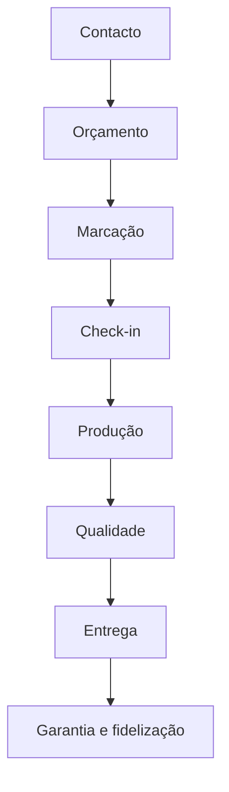
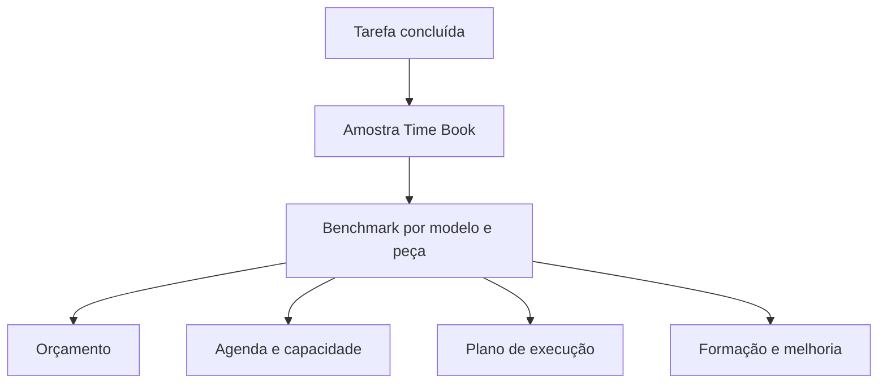
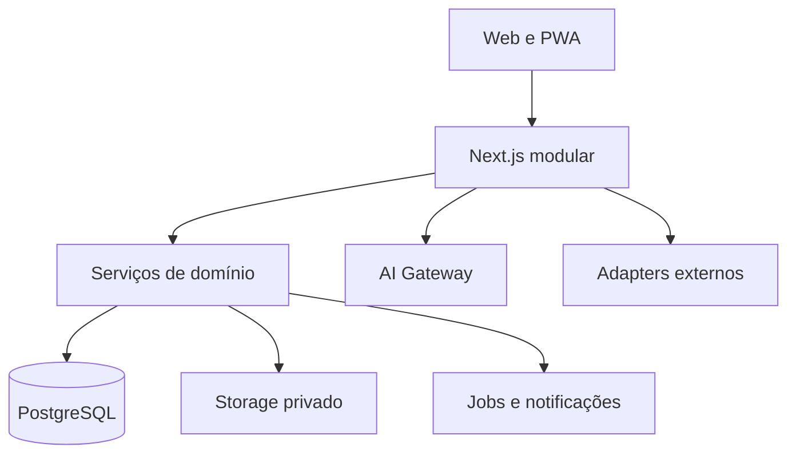
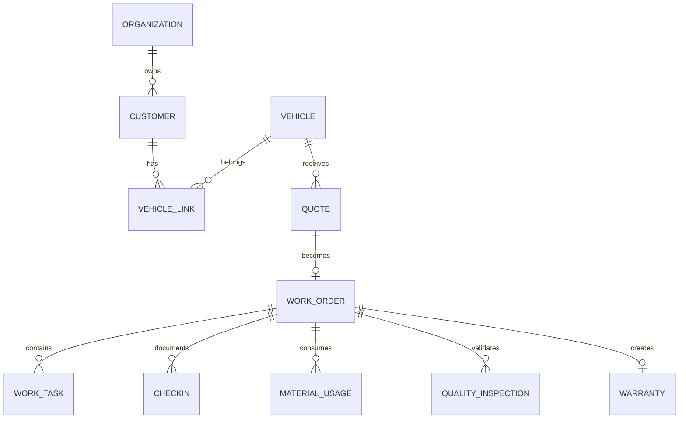
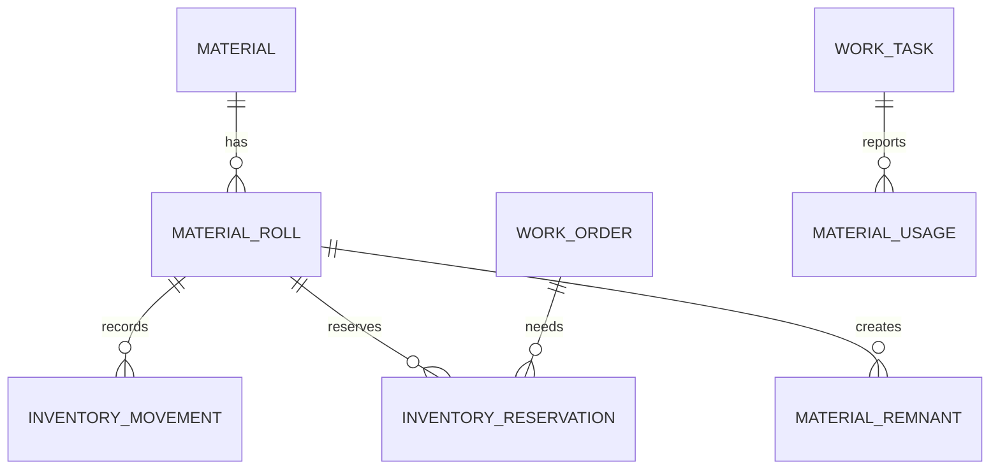
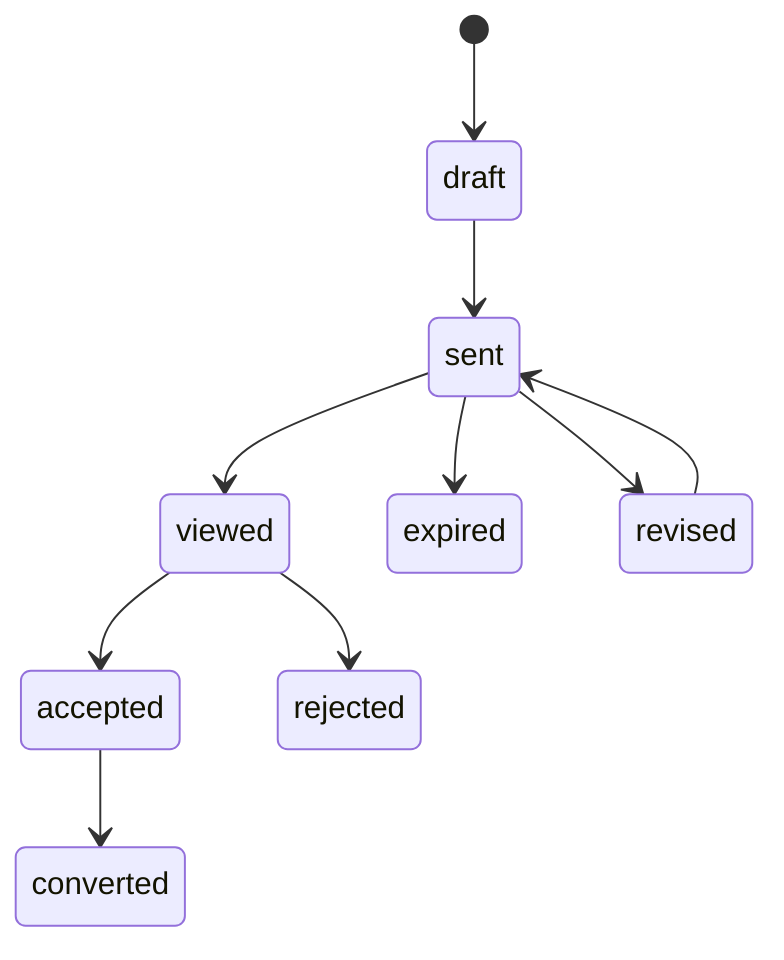
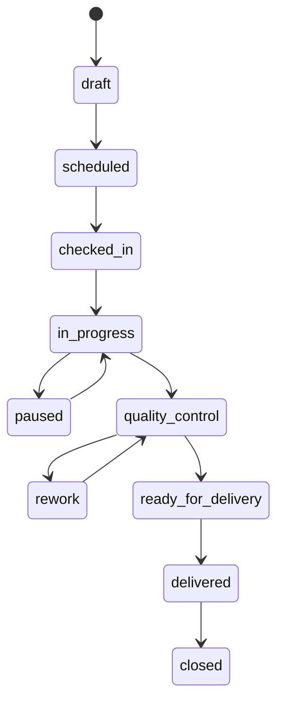
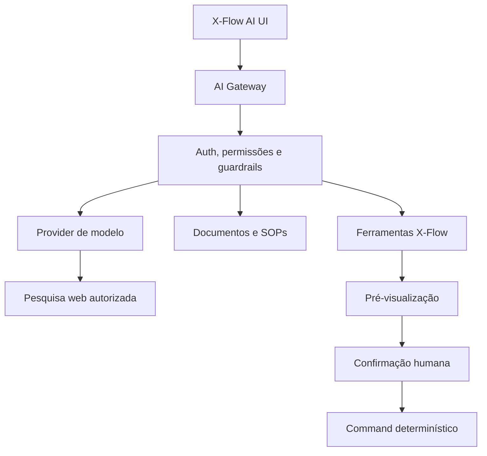
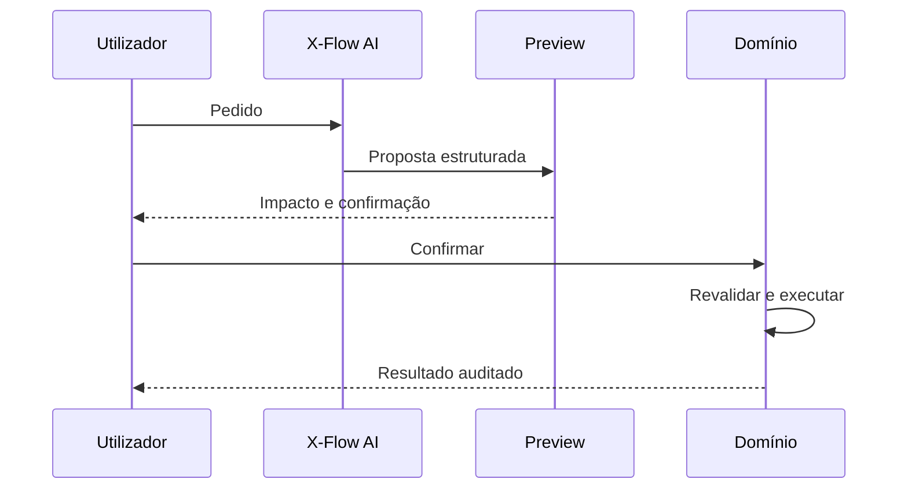

# X-Flow by X-Motion — Master Blueprint para Google AntiGravity

**Versão:** 1.1  
**Data:** 27 de agosto de 2026  
**Última atualização:** 28 de agosto de 2026 — integração do X-Motion Time Book  
**Estado:** fonte única de verdade para planeamento, design e desenvolvimento  
**Product Owner:** Luís  
**Produto:** X-Flow  
**Marca:** X-FLOW by X-Motion  
**Idioma da interface:** português europeu (`pt-PT`)  
**Idioma do código, API e base de dados:** inglês  

> **INSTRUÇÃO PRINCIPAL AO AGENTE ANTIGRAVITY**  
> Lê este documento integralmente antes de criar ou alterar código. Trata-o como a fonte de verdade do projeto. As imagens e o logótipo indicados na secção de assets são referências visuais canónicas. Primeiro apresenta um plano e uma lista curta de decisões realmente bloqueantes; só depois de aprovação inicia a implementação por fases. Não tentes construir todo o produto numa única execução.

## Como usar este documento no AntiGravity

1. Criar um projeto local ou worktree dedicado ao X-Flow.
2. Colocar este ficheiro na raiz como `X-FLOW_MASTER_BLUEPRINT.md`.
3. Colocar as imagens de referência em `assets/references/` e o logótipo em `assets/xflow-logo.svg`.
4. Pedir ao agente: **“Lê integralmente `X-FLOW_MASTER_BLUEPRINT.md`, inspeciona os assets e apresenta o plano da Fase 0 sem escrever código.”**
5. Aprovar ou corrigir o plano.
6. Autorizar uma fase de cada vez.
7. No fim de cada fase, exigir testes, validação visual no browser, capturas desktop/móvel, limitações e atualização deste documento.

## Mapa do documento

- **Parte I — Produto e processos:** visão, utilizadores, módulos, fluxos, valores, métricas e requisitos funcionais.
- **Parte II — Marca e experiência:** logótipo, cores, tipografia, componentes, ecrãs, responsividade e acessibilidade.
- **Parte III — Tecnologia e dados:** stack, repositório, segurança, RLS, entidades, APIs, media, offline, integrações e testes.
- **Parte IV — Inteligência:** X-Flow AI, ferramentas, pesquisa web, RAG, Vision, custos, segurança e avaliação.
- **Parte V — Execução:** fases, histórias, gates, critérios de aceitação, dados demo e qualidade.
- **Parte VI — Futuro comercial:** posicionamento, diferenciação, SaaS, planos, receita e product-market fit.
- **Parte VII — Manual AntiGravity:** instruções, regras `.agents`, prompts, ADRs, decisões pendentes e checklists.
- **Apêndices:** decisões fixas, glossário, comandos de qualidade e frase de arranque.

- A unidade central é a **viatura**, não uma lista genérica de contactos.
- O produto deve parecer **premium, minimalista, preciso, contemporâneo e muito fácil de usar**.
- O símbolo oficial é o **X linear fino e entrelaçado** do mockup, nunca o X grosso alternativo.
- O check-in inclui o registo fotográfico das 5 perspetivas da viatura (frente, lateral esquerdo, lateral direito, traseira e tejadilho).
- Uma ação frequente deve exigir no máximo três toques/cliques sempre que tecnicamente possível.
- A pessoa vê primeiro o que exige atenção, não uma parede de métricas.
- A IA explica, recomenda e prepara; ações importantes exigem confirmação humana autenticada.
- Margens, preços, stock, disponibilidade e conflitos são calculados por código determinístico.
- IA, pesquisa web e integrações externas são substituíveis e nunca podem bloquear o CRM nuclear.
- Preços, custo/hora, margens, impostos, estados e limites são configurações versionadas, não constantes espalhadas no código.
- Multi-organização, permissões e isolamento por `organization_id` existem desde a primeira migração.
- Fotografias, assinaturas, dados pessoais, margens e salários são privados por defeito.
- Não usar dados reais nos ambientes demo, testes, capturas, prompts ou logs.
- O MVP deve resolver o trabalho diário antes de depender de visão computacional avançada.
- O **X-Motion Time Book** usa tempos reais por modelo, serviço, etapa e peça; estimativas nunca são apresentadas como tempos observados.

## Ambição

O X-Flow nasce para tornar a X-Motion excecionalmente organizada e deverá ser arquitetado para, no futuro, poder tornar-se um produto SaaS de referência para empresas de proteção e personalização automóvel. A monetização futura não deve atrasar nem complicar o MVP interno, mas a base técnica deve evitar um redesenho estrutural quando surgirem várias organizações, localizações, planos e limites de utilização.

## Promessa do produto

> **Cada viatura torna-se num processo digital rastreável; cada trabalho concluído torna o próximo orçamento, planeamento e resultado mais preciso.**

## North Star e resultados pretendidos

**North Star Metric:** percentagem de trabalhos concluídos com percurso digital completo — orçamento aprovado, check-in, tarefas/tempos, material real, controlo de qualidade, entrega e garantia — sem reintrodução manual de dados.

Resultados a perseguir:

- check-in completo em menos de três minutos em condições normais;
- orçamento profissional criado em poucos minutos, com custo e margem explicáveis;
- qualquer viatura, tarefa, material ou risco encontrado em menos de dez segundos;
- colaborador inicia a tarefa principal do dia em até dois toques;
- nenhuma promessa de material já reservado a outro trabalho;
- nenhuma entrega com defeito crítico aberto;
- redução progressiva do erro entre horas/material previstos e reais;
- experiência do cliente ao nível de uma marca automóvel premium;
- informação operacional suficientemente estruturada para alimentar IA e modelos preditivos próprios.

---

# Parte I — Produto, processos e requisitos funcionais

---

## 1. Visão

O X-Flow é um CRM e sistema operativo para oficinas especializadas em PPF, wrap/vinil, Color PPF, chrome delete, proteção de óticas, motos e serviços relacionados.

Não é um CRM genérico adaptado a uma oficina. A sua unidade central é a **viatura**, ligada ao cliente, orçamento, produção, materiais, fotografias, equipa, qualidade, garantia e histórico.

### Definição do produto

> Um sistema automóvel inteligente que transforma cada viatura num processo digital completo, desde o primeiro contacto até à garantia e fidelização.

### Quatro dimensões

1. **Clientes** — particulares, empresas, contactos, comunicação e relação comercial.
2. **Viaturas** — passaporte digital, fotografias, danos, serviços, materiais e garantias.
3. **Oficina** — agenda, check-in, produção, stock, ferramentas, equipa e controlo de qualidade.
4. **Gestão** — custos, margem, capacidade, indicadores, decisões e X-Flow AI.

### Percurso principal



## 2. Objetivos

- Reduzir o tempo administrativo e evitar introdução duplicada de dados.
- Tornar o check-in visual, rápido, seguro e rastreável.
- Saber em cada momento o estado, responsável e próxima ação de cada viatura.
- Ligar orçamento aprovado a agenda, material reservado, produção e margem real.
- Medir tempo previsto versus real por modelo, peça, serviço e nível de complexidade.
- Construir o X-Motion Time Book com benchmarks próprios e confiança explícita após sucessivos trabalhos comparáveis.
- Controlar rolos, retalhos, consumíveis, ferramentas, desperdício e compras.
- Criar uma experiência premium para cliente particular e B2B.
- Transformar experiência técnica em método repetível, ensinável e melhorável.
- Apoiar decisões através de IA, mantendo controlo humano.
- Preparar o produto para futura comercialização a outras oficinas.

## 3. Princípios obrigatórios

- **Viatura primeiro:** o passaporte da viatura organiza o histórico técnico.
- **Registar uma vez:** um dado introduzido deve alimentar automaticamente as áreas relacionadas.
- **Imagem antes de texto:** fotografias guiadas, anotações, botões, voz e checklists reduzem relatórios manuais.
- **Estado e próxima ação:** cada cartão deve mostrar o que é, onde está e o que acontece a seguir.
- **IA assistida:** a IA recomenda e prepara; o profissional valida.
- **Código para factos:** margens, disponibilidade, stock e conflitos são calculados por regras determinísticas.
- **Configuração em vez de hardcode:** preços, margens, custo/hora, estados e alertas são editáveis.
- **Privacidade por função:** cada perfil vê apenas o necessário.
- **Auditável e recuperável:** ações importantes ficam registadas e, quando possível, podem ser anuladas.
- **Progressivo:** primeiro resolver os processos nucleares; visão avançada e simulação não atrasam o MVP.

## 4. Âmbito e fases

### MVP interno

- Autenticação e perfis.
- Centro de Comando.
- Clientes, empresas e contactos.
- Viaturas e passaporte digital.
- Leads e pipeline.
- Orçamentos versionados.
- Agenda de oficina.
- Check-in fotográfico.
- Ordens de trabalho e tarefas.
- Registo de horas, materiais, problemas e fotografias.
- X-Motion Time Book v1, alimentado por tarefas e tempos reais.
- Stock de rolos, retalhos, consumíveis e ferramentas.
- Controlo de qualidade.
- Entrega, certificados, garantias e revisões.
- Relatórios operacionais e de margem.

### Segunda versão

- Portal de cliente sem aplicação obrigatória.
- Aprovação, assinatura e sinal online.
- Mensagens automáticas por email e, depois, WhatsApp.
- Área B2B com submissão e acompanhamento de viaturas.
- Sincronização bidirecional com Google Calendar.
- Compras, fornecedores e sugestões de encomenda.
- X-Flow AI em modo de consulta e recomendações.

### Terceira versão

- Reconhecimento automático de marca, modelo, versão e ano.
- Mapa visual de painéis.
- Deteção assistida de danos.
- Deteção de cor original, contraste e cobertura recomendada.
- Estimativa visual de desmontagem, material, horas e sequência.
- Simulação de vinil/PPF/Color PPF.
- Modelos preditivos próprios baseados no histórico real.
- Ações de IA com aprovação e automações controladas.

### Fora do MVP

- Contabilidade certificada ou substituição de software fiscal.
- Compra automática sem aprovação.
- Diagnóstico mecânico.
- Reconhecimento visual tratado como prova pericial.
- Vigilância punitiva de colaboradores.
- Transmissão contínua da oficina para clientes.

## 5. Utilizadores e permissões

| Perfil | Acesso principal | Restrições |
|---|---|---|
| Administrador | Sistema completo, configurações, relatórios, margens, equipa e IA | Nenhuma restrição funcional dentro da organização |
| Responsável de oficina | Produção, agenda, qualidade, stock, ferramentas e equipa operacional | Sem salários/tesouraria privada, salvo permissão explícita |
| Colaborador/técnico | O meu dia, trabalhos atribuídos, fotografias, checklists, tempos, materiais e pedidos | Sem margens, salários, carteira total ou relatórios de gestão |
| Cliente | Próprios orçamentos, viaturas, estado partilhado, documentos, garantia e assistência | Sem dados internos, custos ou fotografias não publicadas |
| Cliente B2B | Viaturas e pedidos da própria empresa, contactos autorizados, documentos e faturação acordada | Sem dados de outros clientes ou análise interna de rentabilidade |

As permissões são aplicadas no servidor e na base de dados, não apenas escondidas na interface.

## 6. Arquitetura de informação

### Menu de administração/gestão

1. Centro de Comando
2. Clientes
3. Viaturas
4. Orçamentos
5. Agenda
6. Produção
7. X-Motion Time Book
8. Check-in
9. Controlo de Qualidade
10. Stock e Materiais
11. Ferramentas
12. Equipa
13. Garantias e Revisões
14. Clientes B2B
15. Relatórios
16. Configurações

### Menu móvel do colaborador

1. O meu dia
2. Trabalhos
3. Fotografias
4. Materiais
5. Pedidos
6. Perfil

### Pesquisa global

Pesquisar por:

- Nome, telefone ou email de cliente.
- Matrícula, VIN, marca ou modelo.
- Número de orçamento ou ordem de trabalho.
- Empresa B2B.
- Referência, cor ou lote de material.
- Ferramenta e QR Code.

Os resultados devem respeitar permissões e apresentar a entidade, contexto e ação principal.

## 7. Estados do percurso comercial e operacional

### Pipeline principal

1. Novo contacto
2. Qualificação
3. Orçamento em preparação
4. Orçamento enviado
5. Aguardar decisão
6. Aprovado
7. Marcação confirmada
8. Check-in realizado
9. Preparação
10. Aplicação
11. Controlo de qualidade
12. Pronto para entrega
13. Entregue
14. Garantia e acompanhamento

Os estados são configuráveis, mas o MVP deve incluir esta sequência. Mudar de estado pode criar tarefas ou notificações, sempre com regras visíveis.

### Estados de ordem de trabalho

`draft`, `scheduled`, `checked_in`, `preparation`, `in_progress`, `paused`, `quality_control`, `ready_for_delivery`, `delivered`, `cancelled`, `archived`.

### Pausas

Uma pausa exige motivo configurável: espera de material, cliente, avaria, cura, tarefa externa, indisponibilidade, retrabalho ou outro.

## 8. Centro de Comando

O primeiro ecrã mostra apenas informação que exige atenção. Deve reproduzir a hierarquia do mockup aprovado.

### Cabeçalho

- Saudação e nome do utilizador.
- Pesquisa global.
- Notificações.
- Perfil e função.
- Ações rápidas: Novo Check-in, Novo Orçamento, Nova Marcação.

### Cartões superiores

- Viaturas hoje na oficina.
- Orçamentos pendentes.
- Capacidade semanal.
- Stock crítico.
- Entregas de hoje.

### Blocos operacionais

- Trabalhos em curso: viatura, serviço, estado, técnico, prazo e progresso.
- Agenda de hoje: hora, viatura, tarefa, técnico e conflito.
- X-Flow Intelligence: alertas ordenados por impacto e urgência.

### Indicadores

- Faturação do mês.
- Margem estimada/real.
- Taxa de ocupação.
- Satisfação do cliente.

### Regras

- Números do mockup são demonstração, nunca hardcoded.
- Um cartão abre a lista já filtrada.
- Alertas críticos usam vermelho; avisos usam dourado; sucesso usa verde.
- Cada recomendação mostra fundamento e ação sugerida.

## 9. Clientes e CRM

### Cliente particular

- Nome, contactos, idioma e canal preferido.
- Morada e dados de faturação opcionais.
- Consentimentos e preferências de comunicação.
- Fonte do contacto.
- Notas internas separadas das comunicações visíveis.
- Viaturas associadas.
- Orçamentos, serviços, garantias, pagamentos e comunicações.
- Próxima ação e responsável.

### Empresa/B2B

- Nome legal e comercial, NIF, morada e condições.
- Vários contactos com funções e permissões.
- Preçário ou desconto negociado.
- Condições de pagamento, prazo e prioridade.
- Várias viaturas e centros/filiais.
- Rentabilidade e faturação por parceiro, apenas administração.

### Leads e follow-up

- Origem, interesse, serviço, viatura, valor potencial e probabilidade.
- Próxima ação obrigatória enquanto oportunidade estiver aberta.
- Lembretes para orçamentos sem resposta.
- Resultado: ganho, perdido, adiado ou sem resposta; motivo estruturado.

## 10. Viatura e passaporte digital

### Identificação

- Matrícula, país, VIN opcional.
- Marca, modelo, versão, ano e carroçaria.
- Cor original e código de cor quando conhecido.
- Quilometragem, combustível/autonomia e notas.
- Proprietário atual e histórico de associação, sem expor dados pessoais antigos.

### Passaporte

- Fotografias antes, durante e depois.
- Danos preexistentes e anotações.
- Serviços, datas e ordens de trabalho.
- Material, referência e lote aplicado.
- Painéis abrangidos.
- Horas previstas e reais.
- Desmontagens e problemas.
- Controlos de qualidade e retrabalho.
- Certificados, garantias e revisões.
- Reclamações e reparações.

O histórico técnico pode permanecer ligado à viatura quando o proprietário muda; os dados pessoais do proprietário anterior não são partilhados.

## 11. Orçamento inteligente

### Criação

1. Selecionar/criar cliente e viatura.
2. Escolher serviço e cobertura.
3. Selecionar carro completo, pacote ou peças.
4. Estimar material, desperdício, horas, desmontagem e adicionais; para horas, consultar primeiro o X-Motion Time Book e mostrar amostras/confiança.
5. Verificar stock e capacidade sem reservar ainda.
6. Calcular custo e margem.
7. Criar opções para o cliente.
8. Guardar versão e enviar link.

### Fórmulas

```text
custo_direto = custo_material + (horas_previstas × custo_hora) + custos_adicionais
margem_valor = preço_sem_iva - custo_direto
margem_percentual = margem_valor / preço_sem_iva × 100
```

O custo empresarial inicial de referência é **33 €/hora**, mas é uma configuração com histórico de vigência.

### Opções de mudança de cor

- **Cobertura Exterior:** superfícies exteriores e desmontagem mínima; a cor original pode ficar visível em aberturas.
- **Cobertura Estendida:** retornos maiores e desmontagem seletiva para reduzir a visibilidade da cor original.
- **Conversão Integral de Cor:** inclui áreas interiores selecionadas e exige mais desmontagem, material e horas.

Se o veículo for branco e a cor de destino for preta, azul-escura ou cinzenta-escura, o sistema recomenda pelo menos Cobertura Estendida e mostra as zonas onde a cor pode ficar visível.

### Aprovação

Ao aprovar:

- bloquear a versão aprovada;
- registar assinatura/aceitação e sinal quando aplicável;
- converter em ordem de trabalho;
- sugerir datas;
- reservar material após confirmação da marcação;
- manter ligações entre orçamento, trabalho e movimentos de stock.

## 12. Agenda X-Flow Calendar

O calendário deve ter uma experiência comparável ao Google Calendar nas funcionalidades relevantes para uma oficina, sem copiar a sua marca.

### Vistas

- Dia, semana, mês e lista.
- Linha temporal de produção.
- Por colaborador.
- Por zona/posto da oficina.
- Entregas.
- Cliente B2B.

### Funcionalidades

- Criar ao clicar numa hora.
- Arrastar para mudar data/hora.
- Redimensionar duração.
- Duplicar e copiar.
- Recorrência e exceções.
- Cores e filtros por tipo, serviço, técnico, viatura e estado.
- Pesquisa por matrícula, cliente ou número.
- Participantes, notas, anexos e notificações.
- Horário de trabalho, ausências e disponibilidade.
- Fuso horário, lembretes e permissões.
- Sincronização bidirecional opcional com Google Calendar numa fase posterior.

### Recursos

Uma marcação pode ocupar simultaneamente:

- viatura;
- colaborador(es);
- zona/posto;
- material reservado;
- ferramenta/equipamento especial;
- preparação;
- aplicação;
- cura/espera;
- controlo de qualidade;
- entrega.

Antes de guardar, detetar conflitos de recurso, capacidade e material. O utilizador pode resolver, ignorar com justificação ou cancelar.

### Marcação inteligente

O sistema analisa horas, competência, espaço, materiais, prazo do cliente e trabalhos existentes, oferecendo até três alternativas. Reorganizações são apresentadas como simulação antes de alterar eventos.

## 13. Check-in fotográfico

O check-in deve poder ser concluído no telemóvel/tablet em poucos minutos.

### Sequência

1. Ler/introduzir matrícula.
2. Abrir ou criar viatura.
3. Confirmar cliente e serviço.
4. Registar quilometragem e combustível/autonomia.
5. Registar chaves e objetos deixados.
6. Capturar fotografias guiadas.
7. Marcar danos diretamente sobre a imagem.
8. Registar observações e instruções especiais.
9. Obter assinatura.
10. Criar/atualizar ordem de trabalho.

### Fotografias obrigatórias

- Frente.
- Lateral esquerdo.
- Lateral direito.
- Traseira.
- Tejadilho.
- Odómetro (quilometragem) e combustível/autonomia.
- Danos e detalhes específicos quando existentes.

### Qualidade e rastreabilidade

- Verificar foco, exposição, duplicação e enquadramento.
- Não bloquear por IA sem permitir confirmação humana.
- Guardar tipo `before`, `during` ou `after`, data/hora, autor e ordem de trabalho.
- Preservar original e criar versão otimizada para ecrã/IA.

## 14. X-Flow Vision

### Objetivo

Transformar as fotografias do check-in num rascunho técnico validável.

### Saída por viatura

- Marca/modelo/versão/ano sugeridos.
- Cor original e grau de confiança.
- Lista e mapa dos painéis visíveis.
- Danos potenciais para confirmação.
- Complexidade por peça.
- Área e material aproximados.
- Tempo estimado por peça.
- Desmontagem recomendada.
- Risco e pontos delicados.
- Ordem de execução sugerida.
- Necessidade de um ou dois técnicos.

### Painéis mínimos

Para-choques dianteiro/traseiro, capô, guarda-lamas, portas, embaladeiras, retrovisores, tejadilho, pilares, mala, spoiler, puxadores, óticas, frisos, sensores, câmaras e emblemas.

### Contraste e desmontagem

Comparar cor original e destino. Com contraste elevado, sinalizar puxadores, retrovisores, emblemas, matrículas, óticas, frisos, borrachas, spoiler, antena, uniões de para-choques, arestas do capô/mala/portas e entradas selecionadas.

### Sequência de referência

1. Desmontagem geral.
2. Limpeza e descontaminação.
3. Tejadilho e superfícies grandes.
4. Laterais e portas.
5. Frente e para-choques.
6. Traseira.
7. Peças pequenas e acabamentos.
8. Remontagem.
9. Controlo de qualidade.
10. Fotografias e entrega.

Esta sequência é uma sugestão. O profissional pode alterar e indicar o motivo. Instruções relacionadas com ADAS, sensores, câmaras ou componentes elétricos nunca são executadas automaticamente.

## 15. Produção e ordem de trabalho

### Conteúdo

- Viatura, serviço, data prometida e responsável.
- Painéis/peças e sequência.
- Checklists de preparação, aplicação, montagem e qualidade.
- Materiais reservados e usados.
- Cronómetro por tarefa.
- Fotografias durante o trabalho.
- Problemas, pausas e pedidos de decisão.
- Autorizações adicionais do cliente.
- Progresso calculado por tarefas, não introduzido livremente.

### Área “O meu dia”

O colaborador vê:

- horário e prioridades;
- viaturas/tarefas atribuídas;
- tempo previsto;
- fotografias e danos de check-in;
- instruções especiais;
- material reservado;
- checklist;
- próxima tarefa e prazo.

Pode iniciar, pausar, terminar, fotografar, registar material, ditar nota, reportar problema, pedir aprovação e enviar para qualidade.

### Tempos e aprendizagem

Comparar previsto/real, pausas, retrabalho, material e QC. O propósito é melhorar preços, planeamento e formação; não criar vigilância punitiva.

### 15.1 X-Motion Time Book

O **X-Motion Time Book** é a memória técnica de produtividade real da oficina, integrada no X-Flow. Em vez de depender apenas de tempos genéricos, transforma cada tarefa concluída numa amostra estruturada e comparável.

Objetivos:

- saber quanto tempo a X-Motion demora realmente por modelo, geração, carroçaria, serviço, peça e dificuldade;
- separar tempo líquido de aplicação do tempo total de preparação, desmontagem, lavagem/descontaminação, montagem, controlo de qualidade e retrabalho;
- melhorar orçamento, capacidade, prazo prometido, sequência e formação;
- mostrar a precisão e o número de amostras por detrás de cada estimativa;
- criar progressivamente um património técnico próprio, sem confundir estimativa com medição real.

Cada registo deve associar:

- viatura, marca, modelo, geração/ano e carroçaria;
- serviço (`wrap`, `PPF`, `Color PPF` ou outro) e tipo de material;
- peça/painel, lado e zona;
- fase: preparação, desmontagem, lavagem/descontaminação, aplicação, montagem, QC ou retrabalho;
- colaborador(es), início/fim, minutos ativos e pausas justificadas;
- dificuldade, desmontagem, necessidade de uma ou duas pessoas e condições relevantes;
- resultado de QC, retrabalho, material e observações.

#### Caso-base: Audi RS6

Na conversa que originou o conceito, um conjunto de peças de um Audi RS6 em vinil foi concluído em **8 horas**. A extrapolação inicial sugeriu:

- **28–36 horas líquidas de aplicação** para um wrap completo;
- **32–40 horas totais** incluindo preparação, desmontagem, montagem e controlo final.

Este intervalo é uma **hipótese operacional inicial**, não um tempo real de carro completo. Deve ficar identificado como `estimate`, com origem e confiança, e ser substituído progressivamente por registos concluídos.

A experiência longa de Luís em vinil é relevante e transferível; o sistema não deve tratá-lo como iniciante. Contudo, tempos de vinil e PPF permanecem separados, porque são disciplinas, materiais e riscos diferentes.

#### Regra das primeiras 10–15 viaturas

Depois de aproximadamente **10–15 viaturas comparáveis** com dados completos, o X-Flow já poderá criar uma primeira base personalizada útil. Este número é uma meta de maturidade inicial, não autorização para esconder incerteza.

Antes disso, o sistema apresenta:

- baseline manual/configurável;
- amostras existentes;
- mediana e intervalo observado quando possível;
- grau de confiança baixo/médio;
- fatores que podem aumentar ou reduzir o tempo.

Com dados suficientes, o Time Book poderá mostrar, por exemplo:

> `Audi RS6 — Wrap — para-choques dianteiro: mediana X h · intervalo Y–Z h · N amostras · confiança média/alta.`

#### Regras de confiança

- Nunca misturar `actual`, `estimate` e `benchmark` sem identificação visual.
- Mostrar sempre número de amostras, intervalo e data da última atualização.
- Preferir mediana a média quando existirem outliers.
- Não comparar modelos, materiais ou técnicos sem explicar o contexto.
- Pausas não produtivas, espera externa e retrabalho têm categorias separadas.
- Uma correção manual de benchmark exige motivo e auditoria.
- O colaborador vê os seus tempos e referências úteis; análises individuais detalhadas permanecem privadas para gestão/formação.
- O objetivo é melhorar o método e a precisão, nunca criar um ranking punitivo.

#### Utilização automática



O sistema sugere; o responsável pode aceitar ou ajustar a estimativa. A diferença entre previsto e real regressa ao Time Book e melhora o próximo cálculo.

## 16. Stock, materiais e fornecedores

### Rolos de vinil/PPF

- Marca, fornecedor, tipo, cor, acabamento e referência.
- Largura e comprimento inicial/restante.
- Custo total e custo por metro.
- Lote, datas de entrada/validade quando aplicável.
- Localização, fotografia, ficha técnica e garantia.
- Estado: disponível, reservado, em uso, esgotado, danificado ou arquivado.
- Trabalhos e movimentos associados.

### Retalhos

- Material de origem, medidas, fotografia e localização.
- Estado e trabalhos possíveis.
- Sugestão para óticas, pilares e detalhes quando houver dimensão suficiente.

### Consumíveis

Lâminas, fitas, desengordurantes, panos, luvas, primários, limpeza, pulverizadores, ímanes, espátulas, feltros e itens configuráveis.

### Movimentos

`entrada`, `reserva`, `libertação`, `consumo`, `desperdício`, `ajuste`, `devolução`, `transferência`.

Movimentos são imutáveis; correções criam movimento inverso/ajuste. A quantidade atual resulta do histórico.

### Circuito

`orçamento aprovado → material reservado → trabalho iniciado → consumo registado → stock atualizado → custo real calculado`

### Fornecedores e compras

- Contactos, marcas, prazos, portes, condições e histórico.
- Stock mínimo e lista de encomenda.
- Pedido de cotação e ordem de compra.
- Receção parcial/total e atualização de custo.
- Alerta para material reservado em falta.
- Relatório de stock lento e desperdício.

## 17. Ferramentas e equipamentos

- Número interno e QR Code.
- Fotografia, categoria, marca, modelo e série.
- Estado: disponível, atribuída, em utilização, avariada, manutenção ou retirada.
- Localização e colaborador responsável.
- Compra, garantia, reparações e próxima manutenção.
- Check-out/check-in simples por QR Code.

Abrange pistolas de calor, caldeira, máquinas, extensões, escadotes e ferramentas manuais.

## 18. Equipa e Academy

### Perfil

- Fotografia, nome, contacto, função e horário.
- Disponibilidade, férias e ausências.
- Competências e nível por serviço.
- Formação, certificados e metas.
- Ferramentas atribuídas e histórico de trabalhos.

### Privacidade

Dados contratuais, salário e avaliações privadas são separados e visíveis apenas à administração autorizada.

### Métricas úteis

- Precisão de tempo por tipo de trabalho.
- Retrabalho e resultados de QC contextualizados.
- Formação concluída.
- Capacidade e carga de trabalho.

Não criar rankings públicos nem comparar pessoas sem contexto de dificuldade.

## 19. Controlo de qualidade

- Templates por serviço e material.
- Checklist por painel e etapa.
- Evidência fotográfica quando obrigatória.
- Resultado: aprovado, aprovado com observação, requer correção.
- Defeito, causa provável, gravidade, responsável pela correção e tempo de retrabalho.
- Segunda validação após correção.
- Bloquear entrega enquanto existir defeito crítico aberto.

## 20. Entrega, certificado e garantia

### Entrega

- Checklist final, fotografias, quilometragem, combustível/autonomia e objetos.
- Confirmação de pagamento/pendência.
- Assinatura e hora de entrega.
- Guia de manutenção enviado ao cliente.

### Passaporte/certificado

- X-Flow/X-Motion, cliente e viatura.
- Serviço e painéis.
- Marca, referência e lote do material.
- Data, aplicador e ordem de trabalho.
- Condições de garantia.
- Lavagem/manutenção.
- Próxima revisão.
- QR Code para acesso autenticado ou link seguro.

### Garantias e revisões

- Início/fim, cobertura e exclusões.
- Alertas de revisão.
- Pedido de assistência, fotografias e triagem.
- Reclamações, solução, custo e relação com lote/material.

## 21. Portal do cliente

O cliente acede por conta ou link privado e pode:

- ver e aprovar orçamento;
- escolher opções/acabamentos;
- assinar e pagar sinal numa fase posterior;
- consultar data e estado partilhado;
- ver fotografias selecionadas;
- consultar certificado, garantia e manutenção;
- pedir assistência/revisão;
- avaliar o serviço.

O cliente não vê cronómetros internos, margem, notas privadas, defeitos em investigação ou fotografias não publicadas.

## 22. Portal B2B

- Submeter viatura e serviço pretendido.
- Acompanhar estado e prazo.
- Aprovar adicionais conforme permissões.
- Gerir vários contactos e viaturas.
- Consultar documentos, fotografias publicadas e certificados.
- Exportar resumo mensal.
- Aplicar condições comerciais próprias.

Exemplos de parceiros anteriormente mencionados devem ser confirmados antes de importação: Mercedes/Carclasse Barcelos e Amy Motors/HM Motor. Não usar estes nomes em dados demo públicos.

## 23. Relatórios e gestão

### Operacionais

- Capacidade planeada versus utilizada.
- Trabalhos em risco/atraso.
- Horas previstas versus reais.
- Tempo por modelo, painel, serviço e técnico.
- Pausas, causas e retrabalho.

### Financeiros internos

- Receita, custo direto, margem estimada e real.
- Rentabilidade por serviço, viatura, cliente e parceiro B2B.
- Descontos, urgências e adicionais.
- Custos de material e desperdício.

### Stock

- Valor de stock.
- Consumo e desperdício.
- Retalhos aproveitados.
- Stock crítico, reservado e lento.
- Desempenho de fornecedor.

### Experiência

- Satisfação, avaliações, reclamações e recorrência.
- Conversão de leads/orçamentos.
- Tempo médio até resposta e aprovação.

## 24. X-Flow AI

### Presença

- Barra “Pergunta ao X-Flow AI”.
- Painel lateral contextual.
- Texto e voz numa fase posterior.
- Sugestões no Centro de Comando.
- Botão contextual em cliente, viatura, orçamento e trabalho.

### Modo Consultar

Pode responder, pesquisar, comparar, analisar e criar relatórios; não altera dados.

Exemplos:

- “Quanto faturámos este mês?”
- “Qual foi a margem real dos últimos três PPF?”
- “Que trabalhos estão atrasados?”
- “Tenho capacidade para aceitar outro wrap?”
- “Que material falta para a próxima semana?”
- “Quanto demoramos normalmente neste modelo?”

### Modo Executar

Prepara ações como orçamento, marcação, reorganização, reserva, encomenda, atualização ou mensagem. Antes de escrever:

`ação proposta → dados utilizados → impacto → confirmar/cancelar`

### Pesquisa web

- Fornecedores, preço/disponibilidade, fichas técnicas e garantia.
- Métodos, compatibilidades e equipamentos.
- Concorrência, parceiros B2B, legislação e tendências.
- Mostrar fontes, data e grau de confiança.
- Nunca misturar dados privados da empresa com a consulta externa.

### Resumo diário

Número de viaturas, entregas, riscos, stock crítico, orçamentos sem resposta e prioridades. Deve ser gerado a partir de dados reais e permitir abrir cada item.

## 25. Integrações previstas

### MVP

- Supabase Auth, Database e Storage.
- Fornecedor de email transacional configurável.
- OpenAI Responses API através de adaptador, desativada sem chave.

### Posteriores

- Google Calendar OAuth e sincronização bidirecional.
- WhatsApp Business para mensagens aprovadas.
- Pagamentos/sinais, fornecedor a decidir.
- Pesquisa web integrada com fontes.
- Exportação contabilística, não contabilidade certificada.
- MCP/APIs de fornecedores quando existirem e forem autorizados.

## 26. Valores iniciais configuráveis

Usar apenas como seeds administrativos editáveis:

| Serviço | Preço de referência | Material | Tempo |
|---|---:|---:|---:|
| Full PPF automóvel | 3.500 € | ~1.000 € | 32–40 h |
| Wrap completo | 3.500 € | 400–900 € | 32–40 h |
| Chrome delete | 150–450 € | ~50 € | 2–4 h |
| PPF de óticas | 180 € | ~50 € | ~1 h |
| PPF de mota | 850 € | A configurar | A medir |

Custo/hora inicial: **33 €**. Valores não incluem automaticamente IVA; a configuração define se os preços de apresentação incluem ou não imposto.

### Cenário mensal de capacidade

Objetivo anteriormente definido para simulação, não quota obrigatória:

- 3 Full PPF.
- 1 Wrap.
- 4 Chrome delete.
- 4 PPF de óticas.
- 1 PPF de mota.

O dashboard deve permitir comparar realizado, capacidade e cenário-alvo configurável.

## 27. Requisitos não funcionais

### Experiência

- Primeira carga rápida em rede móvel razoável.
- Ações comuns com feedback imediato.
- PWA instalável.
- Formulários recuperam rascunhos.
- Upload resiliente com progresso e retoma quando possível.

### Acessibilidade

- WCAG 2.2 AA como objetivo.
- Teclado, foco visível, labels, contraste e mensagens não dependentes só da cor.
- Movimento reduzido quando preferido pelo sistema.

### Confiabilidade

- Idempotência em aprovações, pagamentos, reservas e webhooks.
- Backups e restauração testados antes de produção.
- Auditoria e observabilidade de erros.

### Escala inicial

- Uma organização, proprietário e pequena equipa.
- Preparado para múltiplas localizações, organizações e utilizadores sem reestruturação total.

## 28. Métricas do produto

- Tempo médio para criar orçamento.
- Tempo médio de check-in.
- Percentagem de trabalhos com horas e material completos.
- Precisão de horas e material previstos.
- Taxa de conflitos evitados.
- Desperdício e uso de retalhos.
- Conversão e tempo de resposta de orçamento.
- Margem prevista versus real.
- Entregas a tempo.
- Satisfação e recorrência.
- Utilização e taxa de aceitação das recomendações de IA.

## 29. Definição geral de concluído

Um módulo só está concluído quando:

- cumpre critérios funcionais e permissões;
- tem migrações e dados sintéticos;
- inclui estados de loading/vazio/erro/sucesso;
- funciona em desktop e móvel relevantes;
- passa lint, typecheck, testes e build;
- foi validado no browser com capturas;
- não contém segredos nem dados reais;
- atualiza documentação afetada;
- foi aprovado por Luís.

## 30. Decisões a não perder

- Nome oficial do produto: **X-Flow**.
- Assinatura visual: **X-FLOW by X-Motion**.
- Logótipo: usar como referência o símbolo linear fino do mockup, não o símbolo alternativo grosso.
- Fotografia do tejadilho é obrigatória no check-in.
- O calendário deve aproximar a facilidade e funcionalidades relevantes do Google Calendar.
- A cor original e contraste influenciam desmontagem e nível de cobertura.
- A viatura tem passaporte digital e pode preservar histórico técnico após mudança de proprietário.
- O colaborador dispõe de área própria “O meu dia”.
- Stock inclui rolos, retalhos, consumíveis, ferramentas, fornecedores e desperdício.
- A IA tem modos Consultar e Executar; ações importantes exigem confirmação.
- A primeira versão não espera pela simulação de cor ou visão avançada para ser útil.
- O X-Motion Time Book regista tempos reais peça a peça e usa aproximadamente 10–15 viaturas comparáveis como primeira meta de maturidade.
- O caso Audi RS6 sustenta apenas uma estimativa inicial: 28–36 h líquidas de aplicação e 32–40 h totais para wrap completo; não é ainda um tempo real completo.
- A experiência de Luís em vinil deve ser refletida nos baselines; não misturar automaticamente benchmarks de vinil e PPF.

---

# Parte II — Marca, design system e experiência

## 31. Personalidade da marca

O X-Flow deve transmitir simultaneamente:

- **precisão automóvel** — tudo parece medido, alinhado e intencional;
- **controlo sereno** — o sistema avisa sem criar ruído ou ansiedade;
- **tecnologia humana** — inteligência poderosa com linguagem compreensível;
- **exclusividade discreta** — premium sem excesso de dourado, brilho ou ornamentação;
- **velocidade** — a interface antecipa a ação e elimina passos repetidos;
- **confiança** — fotografias, histórico, aprovações e custos são rastreáveis.

Palavras a usar como filtro de design: `premium`, `preciso`, `calmo`, `visual`, `inteligente`, `automóvel`, `fiável`.

Palavras a evitar como resultado visual: `gaming`, `casino`, `dashboard genérico`, `luxo barroco`, `neon`, `futurismo ilegível`, `vidro em excesso`.

## 32. Referências visuais e precedência

Quando os ficheiros forem disponibilizados ao projeto, usar esta estrutura:

| Prioridade | Asset | Função |
|---:|---|---|
| 1 | `assets/references/xflow-multi-page-reference.png` | Referência global do Centro de Comando, Check-in, Stock e área móvel “O meu dia” |
| 1 | `assets/references/xflow-dashboard-reference.png` | Hierarquia, densidade, sidebar, cartões, indicadores e acabamento do dashboard |
| 1 | `assets/references/xflow-logo-source-reference.jpeg` | Forma e proporção do logótipo fino escolhido por Luís |
| 2 | `assets/references/xflow-logo-recreated.png` | Reconstrução de maior resolução para comparação |
| 2 | `assets/references/xmotion-logo-reference.jpeg` | Relação com a marca-mãe X-Motion |
| Implementação | `assets/xflow-logo.svg` | Asset técnico centralizado usado pela aplicação até existir vetor final validado |

Se existir conflito, prevalecem o recorte original do logótipo e o mockup aprovado. Não redesenhar a marca de forma criativa sem aprovação explícita de Luís.

## 33. Logótipo X-Flow

### 33.1 Composição canónica

- Símbolo linear à esquerda.
- Duas linhas angulares entrelaçadas formam um losango central e prolongamentos laterais.
- Uma linha é dourada e a outra branco/marfim.
- `X-FLOW` aparece em maiúsculas douradas.
- `by X-Motion` aparece por baixo, menor, em branco/marfim.
- O conjunto respira sobre fundo preto.
- O traço deve ser fino, elegante e uniforme.
- É proibido substituir este símbolo pelo X grosso alternativo anteriormente rejeitado.

### 33.2 SVG técnico de arranque

O seguinte SVG é uma aproximação de implementação. O recorte visual continua a ser a referência final para ajuste de proporções:

```svg
<svg xmlns="http://www.w3.org/2000/svg" viewBox="0 0 460 112" role="img" aria-labelledby="title desc">
  <title id="title">X-Flow by X-Motion</title>
  <desc id="desc">Símbolo geométrico linear dourado e marfim, X-FLOW em dourado e by X-Motion em marfim.</desc>
  <rect width="460" height="112" rx="14" fill="#050606"/>
  <g fill="none" stroke-width="5.5" stroke-linecap="square" stroke-linejoin="miter">
    <path d="M22 26 L69 76 L116 26" stroke="#D3A548"/>
    <path d="M22 76 L69 26 L116 76" stroke="#F1EDE5"/>
  </g>
  <text x="142" y="56" fill="#D3A548" font-family="Montserrat, Manrope, Arial, sans-serif" font-size="38" font-weight="650" letter-spacing="1.2">X-FLOW</text>
  <text x="144" y="82" fill="#F1EDE5" font-family="Montserrat, Manrope, Arial, sans-serif" font-size="17" font-weight="500" letter-spacing="0.2">by X-Motion</text>
</svg>
```

### 33.3 Versões obrigatórias

- horizontal completa, clara sobre fundo escuro;
- horizontal monocromática clara;
- horizontal monocromática escura;
- símbolo isolado;
- símbolo dentro de app icon;
- favicon 16/32/48 px;
- fundo transparente;
- versão para impressão e documentos.

### 33.4 Regras de utilização

- Área de proteção mínima: altura do losango central em todos os lados.
- Largura mínima digital da versão completa: 148 px; abaixo disso usar símbolo.
- Não inclinar, comprimir, alongar, aplicar sombras fortes ou alterar cores livremente.
- Não colocar sobre fotografia sem uma superfície escura com contraste suficiente.
- Não animar continuamente; no máximo uma entrada subtil de traço no splash/loading inicial.
- O ficheiro do logótipo é único e reutilizado por todos os ecrãs, emails, PDFs e portais.

## 34. Paleta e tokens de cor

### 34.1 Cores-base

| Token | Valor | Uso |
|---|---|---|
| `--bg-canvas` | `#050606` | Fundo principal |
| `--bg-sidebar` | `#080A0B` | Navegação e zonas profundas |
| `--surface-1` | `#101314` | Cartões e painéis principais |
| `--surface-2` | `#15191A` | Inputs, hover, cartões internos |
| `--surface-3` | `#1B2021` | Superfície elevada e menus |
| `--border-subtle` | `rgba(255,255,255,.08)` | Divisores e bordas normais |
| `--border-strong` | `rgba(255,255,255,.15)` | Foco estrutural |
| `--gold-500` | `#D3A548` | CTA, seleção e prioridade |
| `--gold-300` | `#E7C77C` | Hover e realce suave |
| `--gold-700` | `#A77C2E` | Pressed e contraste em fundo claro |
| `--text-primary` | `#F1EDE5` | Texto principal |
| `--text-secondary` | `#A9ADAE` | Texto de apoio |
| `--text-muted` | `#747A7C` | Metadados e placeholders |
| `--success` | `#68A46B` | Concluído e saudável |
| `--warning` | `#D3A548` | Atenção e risco moderado |
| `--danger` | `#F05A50` | Erro e risco crítico |
| `--info` | `#6E93B5` | Informação neutra |

### 34.2 Regras cromáticas

- 75–85% da interface deve permanecer em preto, grafite e cinzentos neutros.
- O dourado ocupa pequenas áreas e conduz o olhar: ação principal, seleção, progresso e insight.
- Nunca usar grandes fundos dourados em páginas de trabalho; tornam a experiência cansativa.
- Estados não dependem apenas da cor: incluir ícone, texto e/ou padrão.
- Vermelho é reservado para erro, bloqueio, perigo ou atraso real.
- Verde confirma conclusão; não usar para simples estado ativo.
- Fotografias automóveis são a fonte principal de riqueza visual.

### 34.3 Gradientes permitidos

- Fundo premium: `linear-gradient(145deg, #111515 0%, #080A0B 60%, #050606 100%)`.
- Realce dourado discreto: `linear-gradient(135deg, #E7C77C 0%, #D3A548 48%, #A77C2E 100%)`.
- Overlay sobre fotografia: `linear-gradient(180deg, transparent 35%, rgba(5,6,6,.88) 100%)`.
- Não usar gradientes arco-íris ou halos neon.

### 34.4 Tokens CSS iniciais

```css
:root {
  color-scheme: dark;
  --bg-canvas: #050606;
  --bg-sidebar: #080a0b;
  --surface-1: #101314;
  --surface-2: #15191a;
  --surface-3: #1b2021;
  --border-subtle: rgba(255, 255, 255, 0.08);
  --border-strong: rgba(255, 255, 255, 0.15);
  --gold-300: #e7c77c;
  --gold-500: #d3a548;
  --gold-700: #a77c2e;
  --text-primary: #f1ede5;
  --text-secondary: #a9adae;
  --text-muted: #747a7c;
  --success: #68a46b;
  --danger: #f05a50;
  --info: #6e93b5;
  --radius-sm: 10px;
  --radius-md: 14px;
  --radius-lg: 18px;
  --shadow-card: 0 18px 48px rgba(0, 0, 0, 0.28);
  --shadow-focus: 0 0 0 3px rgba(211, 165, 72, 0.28);
}
```

## 35. Tipografia, ícones e números

### 35.1 Tipografia

- Interface: `Inter Variable` ou `Manrope Variable`; escolher uma e não misturar sem razão.
- Wordmark: tipografia geométrica próxima da referência, validada separadamente.
- Títulos: 500–650; evitar bold excessivo.
- Texto base desktop: 14–16 px.
- Texto operacional móvel: mínimo 16 px.
- Labels auxiliares: mínimo 12 px, com contraste suficiente.
- KPIs: numerais tabulares (`font-variant-numeric: tabular-nums`).
- Comprimento ideal de texto: 45–75 caracteres por linha em conteúdo explicativo.

Escala inicial:

| Papel | Desktop | Mobile | Peso/linha |
|---|---:|---:|---|
| Display | 40 px | 30 px | 600 / 1.08 |
| H1 | 30 px | 25 px | 600 / 1.15 |
| H2 | 22 px | 20 px | 600 / 1.25 |
| H3 | 17 px | 17 px | 600 / 1.35 |
| Body | 15 px | 16 px | 400 / 1.5 |
| Small | 13 px | 14 px | 450 / 1.4 |
| Label | 12 px | 13 px | 550 / 1.3 |

### 35.2 Ícones

- Usar uma biblioteca coerente de traço fino, por exemplo Lucide.
- Espessura visual próxima do símbolo da marca.
- Ícone nunca substitui um label crítico sem tooltip ou alternativa acessível.
- Ícones de 18–20 px na interface; 22–24 px em alvos móveis.
- Evitar misturar ícones preenchidos, emojis e ilustrações de estilos diferentes.

## 36. Espaço, grelha, superfícies e movimento

- Sistema de espaço: múltiplos de 4 px, com ritmo dominante de 8 px.
- Conteúdo desktop: largura fluida, máximo aconselhado de 1680 px.
- Sidebar desktop: 232–248 px; modo compacto 76–84 px.
- Topbar: 68–76 px.
- Cartões: raio 14–18 px, borda subtil e sombra curta.
- Botões e inputs: raio 10–12 px.
- Alvo interativo: mínimo 44×44 px; em ambiente de oficina preferir 48 px.
- Glassmorphism apenas em overlays, pesquisa global e painel de IA; blur 14–22 px e contraste conservado.
- Animações: 120–220 ms, curvas suaves, sem atrasar a ação.
- Drag-and-drop deve ter alternativa por teclado/menu.
- Respeitar `prefers-reduced-motion`.
- Não usar parallax ou animações decorativas contínuas nas áreas operacionais.

## 37. Princípios de interação

1. **Uma ação principal por contexto.** O botão dominante responde ao próximo passo natural.
2. **Progressive disclosure.** Mostrar primeiro o essencial; detalhes técnicos abrem em drawer/accordion.
3. **Reconhecer em vez de memorizar.** Fotografias, matrículas, chips e contexto reduzem memória do utilizador.
4. **Prevenir antes de corrigir.** Avisar conflitos, falta de material e fotografia em falta antes de guardar.
5. **Feedback imediato.** Toda a ação confirma estado em menos de 100 ms visualmente, mesmo quando o servidor demora.
6. **Undo quando seguro.** Arquivar, mover agenda, alterar estado e ações de IA devem poder ser revertidos quando possível.
7. **Guardar rascunho.** Check-in, orçamento e notas não se perdem com falha de rede.
8. **Sem duplicação.** Dados confirmados propagam-se entre orçamento, agenda, ordem, stock e passaporte.
9. **Contexto persistente.** Painel de IA e drawers conhecem a entidade ativa.
10. **Sem surpresas.** Uma ação que comunica, cobra, reserva ou altera prazo mostra impacto antes de executar.

## 38. Componentes obrigatórios

### Estrutura

- `AppShell`
- `Sidebar`
- `MobileBottomNav`
- `Topbar`
- `GlobalSearch`
- `CommandPalette`
- `PageHeader`
- `Breadcrumbs`
- `QuickActions`

### Dados e conteúdo

- `KpiCard`
- `AlertCard`
- `VehicleCard`
- `CustomerCard`
- `WorkOrderCard`
- `StatusBadge`
- `PriorityBadge`
- `ConfidenceBadge`
- `DataTable`
- `FilterBar`
- `SavedView`
- `Timeline`
- `EmptyState`
- `Skeleton`
- `InlineError`

### Calendário e produção

- `CalendarGrid`
- `ResourceTimeline`
- `EventCard`
- `EventDrawer`
- `ConflictPreview`
- `CapacityMeter`
- `TaskTimer`
- `TimeBookBenchmarkCard`
- `TimeBookPanelMap`
- `EstimateVsActualChart`
- `Checklist`
- `IssueReporter`
- `PanelMap`
- `PanelAssessmentCard`

### Check-in e media

- `PhotoCaptureGuide`
- `PhotoQualityIndicator`
- `UploadQueue`
- `DamageAnnotator`
- `SignaturePad`
- `BeforeAfterViewer`

### Stock e ferramentas

- `RollVisual`
- `RemnantCard`
- `StockMovementTimeline`
- `MaterialPicker`
- `ReservationBadge`
- `ToolQrCard`

### IA e portais

- `AiSidePanel`
- `AiAnswer`
- `AiActionPreview`
- `SourceList`
- `CustomerPortalShell`
- `ApprovalCard`
- `WarrantyPass`

Todos os componentes assíncronos incluem `loading`, `empty`, `error`, `success`, `offline` quando relevante e `permission denied` com explicação simples.

## 39. Arquitetura de navegação

### 39.1 Desktop de gestão

1. Centro de Comando
2. Clientes
3. Viaturas
4. Orçamentos
5. Agenda
6. Produção
7. X-Motion Time Book
8. Check-in
9. Controlo de Qualidade
10. Stock e Materiais
11. Ferramentas
12. Equipa
13. Garantias e Revisões
14. Clientes B2B
15. Relatórios
16. Configurações

Agrupar visualmente sem esconder módulos importantes: Operação, Relações, Recursos, Gestão.

### 39.2 Telemóvel do colaborador

- O meu dia
- Trabalhos
- Fotografias
- Materiais
- Pedidos
- Perfil

A bottom navigation mostra no máximo cinco destinos; “Perfil” pode ficar no menu de conta. O botão contextual fixo muda entre `Iniciar tarefa`, `Pausar`, `Retomar`, `Enviar para qualidade`.

### 39.3 Pesquisa global e command palette

Pesquisa por:

- matrícula, VIN, marca e modelo;
- cliente, empresa, email e telefone;
- número de orçamento ou ordem;
- material, referência, lote e ferramenta;
- comandos como “novo check-in”, “criar orçamento” e “abrir agenda hoje”.

Resultados agrupados, com ícone, estado, contexto e ação rápida. Pesquisa respeita permissões no servidor.

## 40. Especificação dos ecrãs principais

### 40.1 Centro de Comando

Objetivo: responder em menos de dez segundos a “o que precisa da minha atenção agora?”.

Estrutura desktop:

1. Sidebar com logótipo, navegação e perfil.
2. Topbar com saudação, período, pesquisa global, notificações e `Pergunta ao X-Flow AI`.
3. Ações rápidas: `Novo check-in`, `Novo orçamento`, `Nova marcação`.
4. Cinco cartões: viaturas na oficina, começam hoje, atrasos/riscos, orçamentos pendentes, stock crítico.
5. Produção de hoje com viatura, fotografia, tarefa, responsável, progresso e próxima ação.
6. Agenda de hoje com horários, entregas e capacidade.
7. Alertas/recomendações X-Flow AI com explicação e CTA.
8. Métricas inferiores: faturação prevista, margem estimada, entregas a tempo e ocupação.

Regras:

- Cartões críticos sobem automaticamente na ordem.
- KPI é clicável e abre a lista já filtrada.
- Não mostrar gráficos sem decisão associada.
- Valores financeiros desaparecem para perfis sem permissão.
- Em mobile, alertas e “O meu dia” surgem antes de métricas.

### 40.2 Clientes

- Alternância `Particulares` / `Empresas`.
- Pesquisa e filtros por estado, origem, responsável, última atividade e próxima ação.
- Lista com nome, contacto principal, viaturas, última interação, valor acumulado e próxima ação conforme permissão.
- Criação rápida sem formulário gigante; campos adicionais aparecem progressivamente.
- Perfil com tabs: `Visão geral`, `Viaturas`, `Orçamentos`, `Trabalhos`, `Comunicações`, `Documentos`.
- Drawer rápido para ligar, enviar mensagem, criar follow-up ou orçamento.
- Detetar duplicados prováveis por telefone/email; nunca fundir automaticamente.

### 40.3 Viatura e passaporte digital

- Hero com fotografia, matrícula, marca/modelo/ano, cor original, cliente atual e estado.
- Ações: `Novo orçamento`, `Marcar`, `Check-in`, `Abrir trabalho`.
- Timeline de contacto, orçamento, check-in, produção, QC, entrega, garantia e revisão.
- Tabs: `Resumo`, `Fotografias`, `Serviços`, `Materiais`, `Garantias`, `Documentos`.
- Before/after por trabalho.
- Histórico técnico pode permanecer na viatura após mudança de proprietário; dados pessoais antigos ficam isolados.
- QR privado abre passaporte/certificado apropriado ao destinatário.

### 40.4 Orçamento inteligente

- Cabeçalho com cliente, viatura, validade e estado.
- Seletor visual de serviços/painéis.
- Estimativa de minutos, material e extras por item.
- Resumo financeiro fixo à direita no desktop; bottom sheet no mobile.
- Opções comparáveis `Cobertura Exterior`, `Cobertura Estendida`, `Conversão Integral`.
- Mostrar benefícios, limites, áreas cobertas, tempo e preço de cada opção.
- Avisar margem baixa, stock insuficiente, prazo improvável e contraste alto.
- Guardar rascunho automático.
- Enviar cria snapshot imutável; editar depois cria versão nova.
- Aprovação liga versão e opção exatas, pode recolher assinatura e sinal, e cria uma única ordem.

### 40.5 X-Flow Calendar

Experiência familiar ao Google Calendar, adaptada à oficina:

- vistas `Dia`, `Semana`, `Mês`, `Lista`, `Timeline de recursos`;
- hoje, setas, mini-calendário, pesquisa e filtros;
- criar ao selecionar intervalo;
- drag-and-drop, resize, duplicar, copiar e recorrência com exceções;
- camadas/filtros por técnico, zona/posto, serviço, estado, entrega e B2B;
- evento mostra matrícula, serviço, responsável, estado e risco;
- drawer permite editar sem abandonar contexto;
- conflito de técnico, viatura, posto, ferramenta ou dependência é mostrado antes de guardar;
- ignorar conflito exige permissão e justificação;
- alteração de entrega simula impacto nos blocos dependentes;
- marcar trabalho aprovado pode sugerir três melhores datas;
- sincronização Google é um adapter posterior e não é a fonte única de verdade.

Recursos simultâneos possíveis: colaborador, posto, viatura, material reservado, ferramenta, preparação, aplicação, cura/espera, QC e entrega.

### 40.6 Check-in móvel

Fluxo imersivo, desenhado para mãos ocupadas e rede instável:

1. Ler/digitar matrícula.
2. Confirmar ou criar cliente e viatura.
3. Confirmar serviço e condições.
4. Quilometragem e fotografia do odómetro.
5. Combustível/autonomia.
6. Chaves e objetos deixados.
7. Fotografias guiadas.
8. Marcar danos sobre fotografias.
9. Observações por texto ou voz.
10. Rever resumo.
11. Assinatura e consentimento.
12. Criar/ligar ordem de trabalho.

Fotografias obrigatórias:

- frente;
- lateral esquerdo;
- lateral direito;
- traseira;
- tejadilho;
- odómetro (quilometragem);
- danos/detalhes quando aplicável.

### 40.7 X-Flow Vision Review

Depois do upload, apresentar a análise como rascunho técnico:

- sugestão de marca/modelo/ano e confiança;
- cor original e contraste com cor destino;
- mapa de painéis visíveis;
- danos sugeridos com caixa/área;
- complexidade, minutos e material por painel;
- desmontagem potencial;
- riscos e sensores/câmaras/ADAS;
- sequência recomendada;
- fotografias em falta/insuficientes.

Cada sugestão tem `Confirmar`, `Corrigir` e `Rejeitar`. Factos confirmados e sugestões de IA usam estilos visuais diferentes. Nunca mostrar falsa precisão: `informação insuficiente` é uma saída correta.

### 40.8 Produção e ordem de trabalho

Gestão:

- Kanban de viaturas por fase;
- filtros por prazo, responsável, serviço, risco e posto;
- ordem com mapa da viatura, sequência, tarefas, dependências, materiais, fotografias e problemas;
- progresso calculado a partir de tarefas/pesos;
- linha de tempo de eventos e aprovações.

Colaborador:

- tarefa atual em destaque;
- instruções, painel e fotografia relevante;
- material reservado;
- checklist curta;
- `Iniciar`, `Pausar`, `Retomar`, `Concluir`;
- registo de material e fotografia em poucos toques;
- pedido de ajuda/material/aprovação;
- nota por voz;
- envio para QC.

### 40.8.1 Ecrã X-Motion Time Book

O Time Book tem duas experiências:

**Registo rápido no trabalho**

- o cronómetro herda viatura, serviço, painel, tarefa e colaborador;
- ao concluir, pede apenas dificuldade, condição especial e resultado quando estes dados não forem inferíveis;
- permite dividir tempo entre peças e fases sem duplicar intervalos;
- mostra claramente minutos ativos, pausa, retrabalho e total;
- guardar deve exigir poucos toques e nunca obrigar a escrever relatório longo.

**Biblioteca técnica e análise**

- pesquisa por marca, modelo, geração, carroçaria, serviço, material e painel;
- mapa da viatura com tempo mediano por peça;
- cartões `Tempo líquido`, `Tempo total`, `Amostras`, `Intervalo` e `Confiança`;
- comparação `estimado × real`, não ranking simples entre pessoas;
- filtros para excluir retrabalho, espera, formação assistida ou observações inválidas;
- histórico das amostras e explicação dos fatores de ajuste;
- ação `Usar no orçamento` e `Usar no planeamento`, sempre com preview;
- estado de maturidade: `Sem dados`, `Inicial`, `Em aprendizagem`, `Fiável`.

No mobile, o colaborador vê apenas registo, referência do painel atual e o seu histórico apropriado. A visão agregada, custos e análise individual detalhada respeitam permissões de gestão.

### 40.9 “O meu dia”

- Saudação, horário e estado de disponibilidade.
- Próxima tarefa em cartão dominante.
- Linha do dia com viatura, hora, prioridade e duração prevista.
- Alertas pessoais: material ainda não disponível, instrução nova, tarefa bloqueada.
- Acesso às fotografias de check-in e danos preexistentes.
- Não mostrar margens, faturação, salários ou comparações públicas entre colegas.
- Métricas próprias servem formação e melhoria; não criar vigilância punitiva.

### 40.10 Stock e materiais

- KPIs: stock crítico, reservado, valor, desperdício, encomendas a chegar.
- Tabs: `Rolos`, `Retalhos`, `Consumíveis`, `Movimentos`, `Reservas`, `Fornecedores`.
- Rolo visual com cor, acabamento, referência, lote, largura e metros disponíveis/reservados.
- Retalho com dimensões, fotografia, origem, localização e sugestões de uso.
- Movimento imutável com origem, autor, ordem e custo.
- Disponibilidade = físico − reservas válidas.
- Alertas consideram trabalhos futuros e prazo do fornecedor.
- Scanner QR/barcode para entrada, consumo e localização.

### 40.11 Ferramentas

- Código/QR, fotografia, categoria, estado e localização.
- `Disponível`, `Atribuída`, `Em uso`, `Avariada`, `Em manutenção`.
- Check-out/check-in rápido.
- Responsável e histórico.
- Compra, garantia e manutenção preventiva.
- Equipamento crítico com manutenção vencida não aparece como disponível.

### 40.12 Qualidade, entrega e garantia

- Checklist versionada por serviço e material.
- Inspeção por painel com fotografia/evidência.
- Defeito gera correção, tempo/material extra e revalidação.
- Defeito crítico bloqueia entrega.
- Entrega reúne fotos finais, checklist, pendências, pagamento e assinatura.
- Certificado inclui viatura, serviço, material, lote, data, termos, manutenção, próxima revisão e QR.
- Portal mostra apenas documentos publicados.

### 40.13 Portal do cliente

- Abrir por magic link/OTP; não exigir instalação.
- Ver e comparar orçamento.
- Aprovar opção, assinar e pagar sinal quando integração estiver ativa.
- Ver estado simples e data prevista.
- Receber apenas fotografias selecionadas pela equipa.
- Consultar certificado, garantia e manutenção.
- Pedir assistência/revisão e deixar avaliação.
- Linguagem simples, sem custos internos ou detalhes operacionais sensíveis.

### 40.14 Portal B2B

- Empresa com vários contactos e permissões.
- Submeter nova viatura e serviço.
- Acompanhar múltiplas viaturas em tabela/kanban.
- Preços/condições negociados.
- Aprovação interna e referências próprias.
- Faturação/documentação mensal quando integrada.
- Download de fotografias e certificados publicados.
- Métricas de volume, prazo e estado; rentabilidade apenas interna.

### 40.15 X-Flow AI

- Entrada permanente na topbar.
- Painel lateral mantém visível a entidade ativa.
- Sugestões contextuais dentro de cliente, viatura, orçamento, agenda, stock e trabalho.
- Resposta mostra período, dados usados, grau de confiança e links internos.
- Pesquisa web mostra fontes clicáveis e data de acesso.
- Ação executável surge como cartão `Ação → impacto → confirmar/cancelar`.
- Voz é opcional e nunca o único modo de interação.

## 41. Responsividade

| Largura | Comportamento |
|---|---|
| `≥ 1440 px` | Sidebar fixa, densidade operacional completa, painéis lado a lado |
| `1280–1439 px` | Sidebar fixa/compactável, grelhas fluidas |
| `768–1279 px` | Sidebar recolhível, duas colunas, toque prioritário |
| `< 768 px` | Bottom nav, cards, drawers full-screen, CTA fixo inferior |
| `390 px` | Largura de validação móvel obrigatória |

Tabelas transformam-se em listas no telemóvel. Nunca obrigar scroll horizontal em tarefas frequentes. O calendário móvel pode usar vista agenda/dia como padrão, mantendo acesso às restantes vistas.

## 42. Acessibilidade e inclusão

- Alvo WCAG 2.2 AA para fluxos principais.
- Navegação total por teclado em gestão.
- Foco visível dourado com contraste.
- Labels reais em inputs; placeholder não substitui label.
- Alternativa textual para fotografia, estado e gráfico.
- Não depender apenas de cor.
- `aria-live` para uploads, timers e feedback relevante.
- Dialogs prendem foco e devolvem-no à origem.
- Tamanho e espaçamento adequados a luvas/mãos ocupadas.
- Português claro e terminologia consistente.
- Respeitar zoom a 200%, reduced motion e preferências do sistema.

## 43. Microcopy e tom de voz

- Português europeu.
- Frases curtas, diretas e profissionais.
- Dizer o que aconteceu e qual o próximo passo.
- Evitar culpabilizar o utilizador.
- Explicar consequência e solução nos alertas.
- A IA admite incerteza.

Exemplos:

- Bom: `Falta a fotografia do tejadilho. Adiciona-a para concluir o check-in.`
- Mau: `Erro de validação 422.`
- Bom: `Este rolo tem 11,4 m disponíveis, mas o trabalho precisa de cerca de 14 m.`
- Bom: `Confiança média — confirma o painel e a desmontagem.`
- Bom: `A alteração pode atrasar a entrega do BMW em 4 horas.`

## 44. Validação visual obrigatória

Para cada ecrã prioritário:

1. Abrir as referências antes de implementar.
2. Construir com tokens e componentes reutilizáveis.
3. Usar dados demo centralizados e sintéticos.
4. Capturar 1440 px, 1024 px, 768 px e 390 px quando aplicável.
5. Comparar hierarquia, proporções, espaçamento, contraste, texto e estados.
6. Corrigir discrepâncias relevantes.
7. Testar teclado, toque e reduced motion.
8. Registar limitações conhecidas.
9. Obter aprovação de Luís antes de declarar o sistema visual estável.

---

# Parte III — Arquitetura técnica e modelo de dados

## 45. Decisão arquitetural

Construir inicialmente um **monólito modular web/PWA**, com fronteiras de domínio claras. Esta abordagem é mais simples, económica e rápida do que microserviços, mantendo uma rota segura para crescer.

Princípios:

- frontend, API e regras de domínio no mesmo repositório;
- PostgreSQL como fonte de verdade;
- módulos comunicam através de serviços tipados, não por acesso descontrolado às tabelas;
- integrações e modelos de IA atrás de adapters;
- processos críticos são idempotentes e auditáveis;
- leitura otimizada pode usar views/materialized views sem duplicar a verdade;
- multi-tenant e multi-localização preparados desde o início;
- feature flags separam o MVP interno de capacidades futuras/SaaS.



## 46. Stack recomendada

| Camada | Escolha inicial | Regra |
|---|---|---|
| Framework | Next.js App Router, versão estável | Server Components por defeito; Client Components apenas quando há interação |
| Linguagem | TypeScript `strict` | Proibir `any` não justificado |
| UI | React + Tailwind CSS + Radix/shadcn como primitives | Tokens X-Flow próprios; não aceitar aparência genérica de template |
| Formulários | React Hook Form + Zod | Schema partilhado entre UI e servidor |
| Dados assíncronos | Server Actions/Route Handlers + TanStack Query quando necessário | Cache explícita e invalidação por domínio |
| Base de dados | Supabase PostgreSQL | Migrações versionadas, RLS e backups |
| Autenticação | Supabase Auth | Email/password ou magic link para equipa; OTP/magic link para portais |
| Ficheiros | Supabase Storage privado | URLs assinadas, derivados e políticas por visibilidade |
| Realtime | Supabase Realtime apenas em casos úteis | Tarefas, agenda e notificações; não subscrever tudo |
| Calendário | `CalendarEngine` adapter sobre FullCalendar core | Validar licença antes de Resource Timeline premium; não acoplar o domínio à biblioteca |
| Estado local | React state/Zustand apenas para UI complexa | Servidor continua fonte de verdade |
| Testes unitários | Vitest | Regras financeiras, stock, estados e permissões |
| Testes de UI | Testing Library + axe | Comportamento e acessibilidade |
| E2E | Playwright | Percursos críticos desktop/móvel |
| Observabilidade | Sentry/OpenTelemetry através de adapter | Redação de PII e correlation id |
| CI | GitHub Actions ou equivalente | lint, typecheck, unit, integration, E2E crítico e build |
| Deploy inicial | Vercel + Supabase, configurável | Ambientes local, preview, staging e production |
| PWA | Manifest, service worker e installability | Offline seletivo para check-in/tarefas, não a base inteira |

Não usar um fornecedor externo só porque está disponível. Cada dependência deve resolver um requisito real, ter licença compatível, manutenção ativa e caminho de substituição.

## 47. Estrutura recomendada do repositório

```text
/
├── .agents/
│   ├── agents.md
│   ├── rules/
│   ├── skills/
│   └── workflows/
├── assets/
│   ├── references/
│   └── xflow-logo.svg
├── docs/
│   ├── adr/
│   ├── api/
│   └── runbooks/
├── public/
├── src/
│   ├── app/
│   ├── components/
│   │   ├── ui/
│   │   └── xflow/
│   ├── domains/
│   │   ├── identity/
│   │   ├── crm/
│   │   ├── vehicles/
│   │   ├── quoting/
│   │   ├── scheduling/
│   │   ├── checkin/
│   │   ├── production/
│   │   ├── inventory/
│   │   ├── quality/
│   │   ├── aftercare/
│   │   └── intelligence/
│   ├── lib/
│   ├── server/
│   ├── styles/
│   └── test/
├── supabase/
│   ├── migrations/
│   ├── seed.sql
│   └── tests/
├── e2e/
├── X-FLOW_MASTER_BLUEPRINT.md
└── .env.example
```

Cada domínio deve conter, quando aplicável: `types`, `schemas`, `queries`, `commands`, `services`, `policies`, `components` e `tests`. Evitar uma pasta genérica `utils` que acumula lógica de negócio.

## 48. Rotas da aplicação

Rotas internas sugeridas:

```text
/login
/dashboard
/customers
/customers/[customerId]
/vehicles
/vehicles/[vehicleId]
/leads
/quotes
/quotes/[quoteId]
/calendar
/checkins/new
/checkins/[checkinId]
/production
/work-orders/[workOrderId]
/time-book
/time-book/[benchmarkId]
/my-day
/inventory
/inventory/rolls/[rollId]
/tools
/team
/quality
/warranties
/b2b
/reports
/settings
```

Portais separados:

```text
/portal/[secureContext]
/b2b-portal/[secureContext]
```

Não colocar IDs sensíveis ou tokens permanentes em URLs públicas. Magic links expiram e são trocados por sessão com âmbito limitado.

## 49. Convenções de código

- Componentes: `PascalCase`.
- Funções/variáveis: `camelCase`.
- Tabelas/colunas: `snake_case`.
- Rotas e ficheiros públicos: `kebab-case`.
- IDs: UUID.
- Dinheiro: inteiros em cêntimos + `currency` ISO 4217.
- Duração: minutos inteiros.
- Comprimento interno: milímetros; UI converte para m/cm.
- Área: unidade explícita, preferencialmente `square_millimeters` ou decimal controlado com unidade.
- Datas: UTC na base de dados; `Europe/Lisbon` por defeito na apresentação; timezone configurável por organização.
- Matrícula: guardar original para display e normalizada para pesquisa.
- Telefone: normalização E.164 quando possível.
- Soft delete/arquivo para entidades de negócio; nunca apagar ledger de stock/auditoria.
- Enums no código e constraints na DB; mudanças de estado passam pelo serviço de domínio.
- UI em pt-PT; nomes internos em inglês.

## 50. Multi-organização, localizações e futura comercialização

Desde a primeira migração:

- todas as tabelas de negócio incluem `organization_id`;
- entidades operacionais relevantes incluem opcionalmente `location_id`;
- o utilizador pertence através de `organization_memberships`;
- RLS filtra organização e, quando aplicável, localização;
- `organizations` guardam locale, timezone, moeda, numeração e configuração;
- `locations` guardam morada, horário, postos e preferências locais;
- temas, catálogos, preços, templates e automações pertencem à organização;
- funcionalidades pagas futuras são avaliadas por `entitlements`, não por condicionais espalhadas;
- limites de IA/storage/utilizadores são medidos por `usage_records`.

No MVP existe uma organização X-Motion e uma localização principal, mas nunca assumir isso na estrutura.

## 51. Segurança e permissões

### 51.1 RBAC base

| Papel | Pode | Não pode |
|---|---|---|
| `admin` | Configuração total, finanças, equipa privada, IA e auditoria | — |
| `workshop_manager` | Agenda, produção, stock, equipa operacional e QC | Salários/dados contratuais salvo permissão adicional |
| `technician` | Tarefas atribuídas, checklists, tempo, fotos, materiais e pedidos | Margem, faturação, salários, dados de outros clientes sem necessidade |
| `customer` | Próprios orçamentos, estado publicado, documentos e garantia | Dados internos, outras viaturas/clientes |
| `b2b_user` | Dados da empresa/contactos/viaturas autorizados | Rentabilidade interna e outras contas |

Permissões granulares futuras usam a forma `resource.action`, por exemplo `quotes.view_margin`, `schedule.override_conflict`, `inventory.adjust`, `ai.execute_action`.

### 51.2 Defesa em profundidade

- RLS no PostgreSQL; filtro na UI não é segurança.
- Autorização novamente verificada no command/server action.
- Campos sensíveis não são selecionados nem enviados a perfis sem acesso.
- Buckets privados e URLs assinadas de curta duração.
- Assinaturas, tokens OAuth e API keys exclusivamente server-side/secret store.
- Rate limiting em auth, portais, uploads, pesquisa e IA.
- CSRF/origin validation nas mutações apropriadas.
- Content Security Policy e headers seguros.
- Validação MIME, tamanho, dimensões e malware nos uploads.
- Logs com PII redigida.
- Audit log para mudança de papel, preço, margem, ajuste de stock, override, assinatura e ação de IA.
- Reautenticação para exportações sensíveis, alteração de permissões e configurações críticas.

### 51.3 RGPD e privacidade

- Consentimento e finalidade registados.
- Política de retenção configurável por tipo de dado.
- Exportação e eliminação/anomização assistidas, preservando obrigações legais e histórico técnico legítimo.
- Separar proprietário atual de histórico técnico da viatura.
- Fotografias de matrícula/interior são privadas por defeito.
- Só fotografias explicitamente publicadas ficam visíveis no portal.
- Processadores externos e transferências são documentados antes de produção.
- Textos jurídicos começam como `rascunho — validar juridicamente`.

## 52. Modelo de dados — convenções

- PostgreSQL + UUID.
- Campos comuns: `id`, `organization_id`, `created_at`, `updated_at`, `created_by`, `archived_at` quando aplicável.
- `location_id` nas entidades operacionais que variam por oficina.
- Valores monetários em `amount_cents` e `currency`.
- Durações em minutos.
- Medidas têm unidade explícita.
- Timestamps em UTC.
- Snapshots financeiros e aprovações são imutáveis.
- Movimentos de stock e auditoria são append-only.
- JSONB apenas para dados flexíveis/versionados; não substituir colunas consultadas frequentemente.

## 53. Relações centrais





## 54. Entidades por domínio

### 54.1 Organização, autenticação e equipa

| Tabela | Campos/regras principais |
|---|---|
| `organizations` | `name`, `slug`, `timezone`, `locale`, `currency`, dados comerciais, numeração, estado |
| `locations` | organização, nome, morada, timezone opcional, horário, estado |
| `profiles` | `auth_user_id`, nome, fotografia, telefone, estado, último acesso |
| `organization_memberships` | perfil, organização, papel, localizações permitidas, estado |
| `roles` / `permissions` | papel base e capacidades granulares |
| `employees` | perfil operacional, função, entrada, horário base, contacto, estado |
| `employee_private_details` | contrato, salário e notas privadas; política exclusiva de administração |
| `employee_skills` | serviço/competência, nível, certificação, avaliação |
| `employee_absences` | tipo, início/fim, estado, notas privadas apropriadas |
| `work_schedules` | turnos, intervalos, exceções e capacidade |

### 54.2 CRM e B2B

| Tabela | Campos/regras principais |
|---|---|
| `customers` | `individual`/`business`, nome, idioma, origem, estado, responsável, consentimentos |
| `customer_contacts` | email, telefone, função, canal, principal e permissões |
| `customer_addresses` | faturação, entrega ou outra |
| `b2b_accounts` | condições, prazo de pagamento, desconto/preçário, prioridade, limite e notas |
| `customer_communications` | canal, direção, assunto, resumo/conteúdo, estado, entidade e visibilidade |
| `leads` | cliente potencial, viatura, serviço, origem, etapa, valor, probabilidade e próxima ação |
| `followups` | data, motivo, responsável, estado e resultado |

Uma oportunidade aberta tem sempre próxima ação ou justificação explícita.

### 54.3 Viaturas

| Tabela | Campos/regras principais |
|---|---|
| `vehicles` | matrícula/país, VIN, marca, modelo, versão, ano, carroçaria, cor/código, km e estado |
| `vehicle_customer_links` | cliente, viatura, início/fim, relação e consentimento |
| `vehicle_panels` | código, nome, lado, posição, template e estado |
| `vehicle_documents` | tipo, storage path, visibilidade e validade |
| `vehicle_notes` | nota, autor, categoria e visibilidade |

`vehicle_customer_links` permite mudança de proprietário sem perder o histórico técnico e sem expor dados pessoais anteriores.

### 54.4 Catálogo, preços e orçamentos

| Tabela | Campos/regras principais |
|---|---|
| `service_catalog` | serviço, duração/material de referência, painéis, estado |
| `service_packages` | Full PPF, frontal e níveis de mudança de cor; composição versionada |
| `pricing_settings` | custo/hora, margem, imposto, vigência; histórico preservado |
| `price_rules` | serviço, segmento, modelo, painel, dificuldade, urgência, B2B, período |
| `quotes` | cliente, viatura, lead, estado, moeda, validade, versão atual e responsável |
| `quote_versions` | snapshot imutável de totais, impostos, desconto, custo, margem e termos |
| `quote_options` | Exterior/Estendida/Integral e alternativas configuráveis |
| `quote_items` | serviço/painel, quantidade, material/minutos, custo, preço e imposto |
| `quote_approvals` | versão/opção, assinante, método, timestamp e evidência |
| `payments` | sinal/pagamento, valor, estado, método e referência externa |

Nunca armazenar dados completos de cartão.

### 54.5 Agenda e capacidade

| Tabela | Campos/regras principais |
|---|---|
| `calendar_events` | tipo, início/fim, timezone, estado, recorrência, cor, cliente, viatura e ordem |
| `calendar_event_participants` | colaborador/contacto, papel, resposta e notificações |
| `resources` | posto/zona, equipamento, ferramenta ou outro |
| `calendar_event_resources` | evento, recurso, início/fim e exclusividade |
| `event_dependencies` | predecessor, sucessor, tipo e folga |
| `external_calendar_links` | provider, calendário/evento externo, sync token e conflito |

Tipos iniciais: `appointment`, `preparation`, `work`, `qc`, `delivery`, `absence`, `maintenance`, `block`.

### 54.6 Check-in, media e Vision

| Tabela | Campos/regras principais |
|---|---|
| `checkins` | ordem, tipo, km, combustível/autonomia, chaves, objetos, notas, estado e assinatura |
| `media_assets` | path, MIME, dimensões, hash, original/derivado, autor, captura e visibilidade |
| `checkin_photos` | media, posição, fase `before/during/after`, qualidade e confirmação |
| `vehicle_damages` | painel, tipo, severidade, descrição, anotação, foto, origem e confirmação |
| `signatures` | assinante, finalidade, hash/evidência, timestamp e versão dos termos |
| `vision_analyses` | provider/modelo, inputs, JSON, confiança, estado, revisão, custo e versões |
| `panel_assessments` | painel, área/material, complexidade, tempo, desmontagem, risco, ordem e confirmação |

Posições fotográficas são enums estáveis, incluindo obrigatoriamente `roof`.

### 54.7 Produção

| Tabela | Campos/regras principais |
|---|---|
| `work_orders` | número, cliente, viatura, orçamento, serviço, datas, estado, prioridade, custos e progresso |
| `work_order_panels` | painel, serviço, cobertura, material e estado |
| `work_tasks` | etapa/painel, dependências, minutos, estado, prioridade, checklist e ordem |
| `task_assignments` | tarefa, pessoa, papel e período |
| `time_entries` | início/fim, minutos, pessoa, tarefa, `work/pause/rework`, origem |
| `time_book_samples` | snapshot da viatura/modelo/serviço/material/painel/fase, minutos ativos/totais, dificuldade, equipa, QC, validade e origem |
| `time_book_benchmarks` | chave comparável, mediana, percentis/intervalo, amostras, confiança, filtros, versão e última atualização |
| `time_book_estimates` | orçamento/ordem/tarefa, minutos sugeridos/aceites, origem do benchmark, intervalo, confiança, amostras e ajuste humano |
| `work_interruptions` | motivo, impacto, início/fim e resolução |
| `work_issues` | problema, gravidade, painel, foto, decisão e resolução |
| `additional_approvals` | alteração, valor, impacto, proposta e decisão do cliente |

`time_entries` continua a ser a fonte temporal bruta. Uma amostra Time Book é produzida apenas quando a tarefa está concluída/validada e preserva o contexto necessário para comparação. Benchmarks são projeções versionadas e recalculáveis; não substituem as amostras.

### 54.8 Stock, fornecedores e ferramentas

| Tabela | Campos/regras principais |
|---|---|
| `suppliers` | contactos, marcas, prazo, portes, pagamento, avaliação e estado |
| `materials` | marca, tipo, cor, acabamento, referência, largura, unidade, ficha e garantia |
| `material_rolls` | material, lote, comprimento inicial, estado, custo, localização, entrada e validade |
| `material_remnants` | rolo de origem, largura/comprimento, estado, foto, localização e reserva |
| `consumable_items` | categoria, SKU, unidade, quantidade, mínimo, custo e localização |
| `inventory_movements` | item, tipo, quantidade, custo, ordem, reserva, motivo e autor |
| `inventory_reservations` | ordem, item, quantidade, validade, estado e conversão/libertação |
| `material_usages` | ordem/tarefa/painel, rolo, usado, desperdício, retalho e custo real |
| `purchase_orders` / `purchase_order_items` | fornecedor, estado, valores, previsão, receção e linhas |
| `tools` | QR, categoria, série, estado, localização, compra, garantia e manutenção |
| `tool_assignments` / `tool_maintenance` | responsável/período e histórico de avaria/manutenção |

`inventory_movements` é a fonte de verdade; a quantidade atual pode ser uma projeção reconciliável.

### 54.9 Qualidade, entrega e pós-venda

| Tabela | Campos/regras principais |
|---|---|
| `quality_templates` / `quality_template_items` | checklist versionada por serviço/material |
| `quality_inspections` / `quality_results` | ordem, inspetor, resultado, painel, observação e evidência |
| `rework_records` | defeito, causa, minutos, material, custo, correção e validação |
| `deliveries` | data, checklist, assinatura, pagamento, km e estado |
| `warranties` | ordem, material/lote, início/fim, termos, estado e documento |
| `maintenance_plans` / `maintenance_visits` | revisões, alertas, realização e resultado |
| `warranty_claims` | pedido, fotos, triagem, cobertura, decisão, solução e custo |
| `customer_reviews` | nota, comentário, consentimento, origem e trabalho |

### 54.10 IA, notificações, auditoria e SaaS

| Tabela | Campos/regras principais |
|---|---|
| `ai_conversations` / `ai_messages` | contexto, utilizador, entidade, modelo, custo, conteúdo minimizado e retenção |
| `ai_actions` | proposta, payload, impacto, estado, aprovador, execução e reversão |
| `ai_sources` | título, URL, domínio, data de acesso e associação à resposta |
| `ai_usage` | provider, modelo, modalidade, tokens, pesquisa, custo e organização |
| `notifications` | destinatário/canal, tipo, prioridade, entidade, agenda, envio e leitura |
| `audit_logs` | ator, papel, ação, entidade, antes/depois redigidos e correlation id |
| `feature_flags` | chave, âmbito, estado e configuração |
| `subscription_plans` | plano, limites e capacidades; futuro |
| `entitlements` | organização, capacidade, limite, vigência e origem |
| `usage_records` | organização, métrica, quantidade, período e fonte |

## 55. Índices e pesquisa

- matrícula normalizada única por organização, com exceção administrativa auditada;
- VIN por organização quando presente;
- nome/email/telefone normalizados de cliente;
- `organization_id + status + date` em orçamentos, ordens e eventos;
- material por referência, cor e lote;
- movimentos por item/data;
- follow-ups por responsável/próxima ação;
- garantias e revisões por data;
- full-text/trigram para pesquisa operacional;
- pgvector apenas para documentos/SOPs, não para substituir consultas estruturadas.

## 56. Integridade crítica e invariantes

- Uma aprovação aponta para uma versão de orçamento imutável.
- Uma ordem tem no máximo um orçamento principal aprovado.
- Aprovar orçamento/criar ordem é idempotente.
- `roof` é obrigatório para concluir check-in, salvo override com permissão/justificação.
- Duas fotos parciais podem satisfazer o tejadilho apenas quando a regra configurada o permite.
- Não colocar `ready_for_delivery` com defeito crítico aberto.
- Não consumir além do disponível sem ajuste autorizado e auditado.
- Reserva reduz disponibilidade, não quantidade física.
- Consumo converte/fecha a reserva correspondente.
- Time entries da mesma pessoa não se sobrepõem, salvo política explícita.
- Uma amostra Time Book nunca nasce de uma estimativa; apenas de tempo real validado.
- Wrap, PPF e Color PPF não partilham benchmark por defeito, mesmo na mesma peça/modelo.
- Alterar ou excluir uma amostra exige motivo, autor e auditoria; o registo temporal original permanece preservado.
- Uma estimativa guarda a versão do benchmark, amostras, intervalo e ajuste usados naquele momento.
- Um evento não sobrepõe recurso exclusivo sem override autorizado.
- Histórico financeiro, ledger de stock, assinatura e auditoria não são editados silenciosamente.
- Conhecer um UUID nunca permite contornar RLS.

## 57. Estados e máquinas de estado

### 57.1 Orçamento



### 57.2 Ordem de trabalho



Cancelamentos exigem razão e não apagam histórico. Transições são centralizadas num serviço de domínio e testadas.

## 58. Fórmulas determinísticas

Configurações iniciais são seeds editáveis; nunca hardcode na UI.

```text
labour_cost = estimated_minutes / 60 × active_hourly_cost
material_cost = sum(expected_usage × active_unit_cost)
predicted_cost = labour_cost + material_cost + consumables + external_costs + contingency
gross_margin_amount = sale_price_without_tax - predicted_cost
gross_margin_rate = gross_margin_amount / sale_price_without_tax
available_stock = physical_stock - active_reservations
actual_job_cost = actual_labour_cost + actual_material_cost + consumables + external_costs + rework_cost
actual_margin = net_revenue - actual_job_cost
```

Regras:

- arredondamento monetário definido por camada financeira e testado;
- imposto aplicado segundo configuração/legislação validada;
- valores históricos usam a configuração vigente no snapshot;
- custo real por hora pode evoluir para incluir overhead, mas deve ser transparente;
- IA nunca recalcula estas fórmulas por texto livre.

## 59. API e comandos de domínio

Separar queries de commands:

- Query retorna dados filtrados por organização/permissão.
- Command valida schema, autorização, estado atual e idempotency key.
- Command abre transação, aplica regra, grava audit log/outbox e devolve resultado tipado.
- Integração externa consome outbox/job; falha externa não corrompe transação principal.

Formato de erro interno sugerido:

```ts
type DomainError = {
  code: string
  message: string
  fieldErrors?: Record<string, string[]>
  correlationId: string
  retryable: boolean
}
```

Nunca enviar stack trace, SQL, segredo ou PII desnecessária ao browser.

## 60. Media, fotografias e documentos

Pipeline:

1. Cliente pede autorização de upload.
2. Servidor valida organização, entidade, posição e limites.
3. Upload direto para bucket privado/quarentena.
4. Job valida MIME real, tamanho, malware e hash.
5. Preserva original e gera derivados WebP/AVIF/JPEG.
6. Remove metadados desnecessários dos derivados; preserva evidência apropriada no original.
7. Regista autor, fase, timestamp, posição e visibilidade.
8. Disponibiliza por URL assinada.

Recomendações iniciais configuráveis:

- upload individual máximo de 25 MB;
- original preservado;
- derivados de 480, 960 e 1600 px;
- thumbnail para listas;
- checksum para idempotência/duplicados;
- fila offline no check-in;
- política de retenção antes de produção real.

## 61. Offline e PWA

Suportar offline seletivo onde o valor é alto:

- abrir “O meu dia” previamente sincronizado;
- iniciar rascunho de check-in;
- capturar fotos e notas em fila local cifrada quando viável;
- marcar checklist/timer com fila de comandos;
- mostrar claramente `offline`, `por sincronizar`, `conflito` e `sincronizado`.

Não prometer edição offline de toda a aplicação. Conflitos não são resolvidos silenciosamente; mostrar versão local/remota e ação segura.

## 62. Jobs, eventos e notificações

Casos assíncronos:

- processamento de fotografias;
- geração de PDF/certificado;
- envio de email/WhatsApp;
- lembretes/revisões;
- sincronização de calendário;
- indexação de documentos;
- análises Vision;
- resumos diários;
- reconciliação de stock e métricas.

Cada job tem `idempotency_key`, tentativas com backoff, dead-letter/estado falhado, correlation id e UI de observação para administradores. No MVP, usar fila/tabela transacional e worker compatível com o deploy; manter interface para trocar fornecedor.

## 63. Integrações por adapter e feature flag

| Integração | Interface | Estado inicial |
|---|---|---|
| Google Calendar | `CalendarSyncProvider` | Posterior; desligada |
| Email | `EmailProvider` | Modo desenvolvimento |
| WhatsApp Business | `MessagingProvider` | Desligada até conta/templates |
| Pagamentos | `PaymentProvider` | Mock/disabled até escolha |
| IA | `AIProvider` | Pode ser desligada sem bloquear CRM |
| Web search | `WebSearchProvider` | Apenas perfis autorizados |
| Maps/matrícula/VIN | `VehicleLookupProvider` | Opcional, sujeito a licença/legalidade |
| Contabilidade | `AccountingExportProvider` | Exportação futura; não substituir software certificado |

## 64. Ambientes e configuração

Ambientes mínimos: `local`, `preview`, `staging`, `production`.

`.env.example` contém apenas nomes e comentários, nunca valores reais. Exemplos:

```dotenv
NEXT_PUBLIC_APP_URL=
NEXT_PUBLIC_SUPABASE_URL=
NEXT_PUBLIC_SUPABASE_ANON_KEY=
SUPABASE_SERVICE_ROLE_KEY=
DATABASE_URL=
AI_PROVIDER=
OPENAI_API_KEY=
GEMINI_API_KEY=
SENTRY_DSN=
EMAIL_PROVIDER=
EMAIL_API_KEY=
GOOGLE_CLIENT_ID=
GOOGLE_CLIENT_SECRET=
```

Variáveis públicas são revistas individualmente. `SERVICE_ROLE`, chaves de IA e OAuth nunca entram no bundle do browser.

## 65. Observabilidade, backups e recuperação

- Logs estruturados com correlation id, organização e entidade, sem conteúdo sensível desnecessário.
- Métricas: erros, latência, jobs, uploads, chamadas IA, custo, sync e falhas de autorização.
- Alertas para erros críticos, fila presa, backup falhado e consumo anormal.
- Backups automáticos e retenção definida antes de dados reais.
- Teste de restauro documentado, não apenas “backup ativo”.
- Migrações reversíveis quando possível e testadas com snapshot anónimo/sintético.
- Runbooks para indisponibilidade de IA, storage, email, calendário e base de dados.

## 66. Performance e metas iniciais

Metas p75 em ligação razoável, a confirmar com dados reais:

- shell e conteúdo principal útil: até 2,5 s;
- navegação interna percebida: até 300 ms com skeleton/optimistic feedback;
- pesquisa operacional: até 500 ms para escala inicial;
- guardar ação normal: até 700 ms, sem contar integração externa;
- upload mostra progresso imediatamente;
- painel AI começa streaming em até 2 s quando provider responde normalmente.

Evitar N+1, otimizar imagens, paginar listas, virtualizar apenas quando necessário e medir antes de otimizar prematuramente.

## 67. Estratégia de testes

### Unitários

- cálculo de custo, IVA, desconto e margem;
- disponibilidade/reserva/consumo de stock;
- normalização de matrícula/telefone;
- transições de estado;
- conflitos e capacidade;
- progressão de tarefas;
- schemas de IA/Vision.

### Integração

- commands com PostgreSQL/RLS;
- aprovação idempotente de orçamento;
- criação de ordem e reservas;
- upload/media metadata;
- QC bloqueia entrega;
- ações de IA propostas/aprovadas.

### E2E

- login → cliente → viatura;
- orçamento → aprovação → ordem;
- agenda → check-in completo com tejadilho;
- colaborador → iniciar/pausar/concluir;
- consumo de material → custo real;
- QC → entrega → certificado;
- cliente/B2B só vê dados autorizados.

### Visual e acessibilidade

- snapshots/capturas nas larguras definidas;
- axe + revisão manual;
- teclado, foco, zoom e reduced motion;
- contraste em dark mode;
- estados vazio/erro/offline.

---

# Parte IV — X-Flow AI, pesquisa e inteligência operacional

## 68. Melhor caminho para integrar IA

O melhor equilíbrio entre facilidade, custo e qualidade é:

1. **Não treinar um grande modelo próprio no início.** É caro, exige dados e não cria vantagem imediata.
2. Criar uma camada `AI Gateway` pertencente ao X-Flow.
3. Ligar essa camada a uma API de modelo existente.
4. Usar regras determinísticas e SQL para factos; usar IA para linguagem, síntese, visão e explicação.
5. Recolher correções e resultados operacionais estruturados.
6. Só depois criar pequenos modelos próprios para previsão de tempo, material, desperdício e atraso.

Fornecedor inicial recomendado: **OpenAI Responses API**, através de adapter. Preparar adapter Gemini. Para desenvolvimento/futuro local, permitir Ollama em tarefas não críticas e compatíveis, sem assumir que terá a mesma qualidade multimodal.

Isto evita vendor lock-in e permite escolher modelo por preço/qualidade sem reescrever o produto.

## 69. Arquitetura da inteligência



Componentes:

- `AI Gateway`: autenticação, contexto, routing, budget, redaction, tracing e schemas.
- `Context Builder`: organização, papel, entidade ativa, período e dados mínimos.
- `Tool Registry`: ferramentas autorizadas por papel/modo.
- `Provider Router`: escolhe provider/modelo por tarefa.
- `Knowledge Retrieval`: pesquisa SOPs, fichas e políticas.
- `Web Research`: pesquisa atual com fontes, quando permitido.
- `Action Orchestrator`: proposta, impacto, aprovação e execução.
- `AI Usage Ledger`: tokens, imagens, pesquisas, latência, custo e erro.
- `Evaluation Harness`: casos de teste e métricas.

Contrato inicial:

```ts
interface AIProvider {
  answer(input: AssistantInput): Promise<AssistantResult>
  streamAnswer(input: AssistantInput): AsyncIterable<AssistantChunk>
  analyzeImages(input: VisionInput): Promise<VisionResult>
  embed(input: EmbeddingInput): Promise<number[][]>
}
```

## 70. O que a IA faz e o que o código faz

| Necessidade | Responsável |
|---|---|
| Resumir histórico e explicar métricas | Modelo de linguagem |
| Redigir orçamento/mensagem | Modelo; humano aprova |
| Pesquisar fornecedores e documentação | Modelo + pesquisa com fontes |
| Interpretar fotografias | Modelo multimodal + revisão humana |
| Calcular preço, imposto e margem | Código determinístico |
| Calcular stock disponível | Ledger/query de inventário |
| Detetar conflito de agenda | Regras/constraints |
| Encontrar três datas possíveis | Motor de capacidade/otimização |
| Explicar alternativas de agenda | IA sobre resultados do motor |
| Prever duração após dataset suficiente | Modelo estatístico próprio |
| Enviar mensagem, criar encomenda ou mudar agenda | Command após confirmação |

Nunca aceitar uma resposta textual do modelo como valor financeiro ou quantidade de stock sem ferramenta/fonte de verdade.

## 71. Presença da IA na experiência

- Barra global `Pergunta ao X-Flow AI`.
- Painel lateral contextual.
- Botão `Analisar` em cliente, viatura, orçamento, agenda, stock e trabalho.
- Resumo diário no Centro de Comando.
- Insights discretos nos cartões, sem pop-ups constantes.
- Entrada por texto e voz.
- Links internos que levam aos registos usados.
- Resposta curta por defeito, com `Ver análise` para detalhe.

Exemplos:

- `Que trabalhos correm risco de atraso esta semana?`
- `Tenho capacidade para outro wrap antes de sexta?`
- `Porque é que a margem deste PPF está abaixo do objetivo?`
- `Que rolos estão reservados mas provavelmente não serão suficientes?`
- `Resume o histórico desta viatura.`
- `Prepara follow-up para os orçamentos sem resposta há quatro dias.`
- `Procura a ficha técnica oficial desta referência e mostra as fontes.`

## 72. Modos Consultar e Executar

### Consultar

- não altera dados;
- consulta entidades autorizadas;
- usa funções determinísticas;
- pesquisa documentos internos;
- pesquisa web apenas quando autorizado/necessário;
- mostra período, dados e fontes.

### Executar

O modelo não executa diretamente. Produz uma proposta estruturada. A UI mostra:

- ação;
- motivo;
- registos afetados;
- antes/depois;
- impacto em cliente, prazo, stock, capacidade e margem;
- notificações que serão preparadas/enviadas;
- risco e possibilidade de reversão;
- `Confirmar` ou `Cancelar`.

Após confirmação autenticada, o servidor revalida tudo, executa command idempotente e cria `ai_action` + `audit_log`.

## 73. Classificação de risco das ações

| Nível | Exemplos | Regra |
|---|---|---|
| 0 — Leitura | Resumo, pesquisa, explicação | Executar automaticamente dentro da permissão |
| 1 — Rascunho | Mensagem, orçamento draft, checklist | Criar rascunho; humano revê antes de publicar |
| 2 — Mutação reversível | Reservar material, criar follow-up, mover bloco não notificado | Preview + confirmação |
| 3 — Impacto externo/financeiro | Enviar mensagem, alterar entrega, emitir encomenda, aplicar desconto | Preview detalhado + confirmação reforçada |
| 4 — Proibido à IA | Comprar sem aprovação, apagar ledger, mudar salário/papel, desmontagem crítica automática | Bloquear; apenas fluxo humano autorizado |

## 74. Ferramentas read-only iniciais

```text
get_dashboard_summary(period)
get_customer_summary(customer_id)
get_vehicle_passport(vehicle_id)
get_quote_details(quote_id)
get_work_order_status(work_order_id)
get_schedule_capacity(range, filters)
get_inventory_availability(material_ids, date_range)
get_profitability(filters)
get_quality_summary(filters)
get_warranty_due(range)
get_time_book_benchmark(vehicle, service, panel, filters)
search_internal_documents(query, filters)
```

Todas as ferramentas:

- resolvem `organization_id` pela sessão, nunca pelo texto do modelo;
- verificam papel e campos permitidos;
- aceitam schemas Zod/JSON Schema estritos;
- devolvem dados mínimos e tipados;
- registam correlation id e tempo;
- rejeitam IDs de outra organização mesmo que válidos.

## 75. Ferramentas de ação futuras

```text
draft_quote(input)
propose_schedule_changes(input)
prepare_inventory_reservation(input)
prepare_purchase_order(input)
draft_customer_message(input)
prepare_work_order_update(input)
create_followup_draft(input)
prepare_warranty_response(input)
```

Fluxo obrigatório:



## 76. Contexto e grounded answers

Cada pedido contém apenas o necessário:

- organização e papel;
- idioma/locale;
- entidade ativa;
- período explícito;
- resultados de ferramentas autorizadas;
- documentos relevantes;
- intenção e modo;
- histórico recente resumido.

Regras de resposta:

- indicar `Hoje`, `esta semana` ou datas absolutas de forma não ambígua;
- dizer de onde vêm os números;
- incluir link interno para entidade;
- separar facto, estimativa e recomendação;
- mostrar confiança quando há interpretação;
- admitir falta de dados;
- nunca inventar matrícula, preço, stock, prazo, cliente ou fonte.

## 77. RAG e conhecimento interno

Usar pesquisa semântica apenas para documentos:

- SOPs X-Motion;
- fichas técnicas;
- garantias de fabricantes;
- manuais de ferramentas;
- políticas internas;
- guias de manutenção;
- formação/Academy.

Pipeline:

1. upload privado;
2. validação e classificação;
3. extração de texto;
4. divisão em fragmentos com contexto;
5. embedding;
6. indexação com organização, versão, tipo, serviço/material e permissões;
7. retrieval filtrado antes de ranking semântico;
8. resposta com citações internas.

Não converter toda a base de dados relacional em embeddings. Para stock, margem, cliente e agenda, usar queries/ferramentas.

## 78. Pesquisa na Internet

Casos:

- fornecedores de PPF/vinil;
- preço e disponibilidade pública;
- fichas técnicas e garantias;
- instruções oficiais;
- compatibilidade de produtos;
- novas tecnologias e ferramentas;
- potenciais parceiros B2B;
- legislação a encaminhar para validação profissional.

Requisitos:

- mostrar título, domínio, URL e data de acesso;
- distinguir fabricante, distribuidor, fonte oficial e fórum/conteúdo informal;
- não apresentar preço sem data/moeda/condição;
- não enviar matrícula, nome, telefone, email, margem, salário ou orçamento interno;
- sanitizar consulta antes de sair do sistema;
- tratar página/documento externo como dado não confiável, nunca como instrução de sistema;
- não executar código, download ou compra sugeridos pela página;
- permitir guardar uma fonte aprovada na biblioteca interna.

Exemplo seguro de consulta externa: `fornecedor Portugal PPF <marca> <referência>`.

## 79. Resumo diário inteligente

Gerado a uma hora configurável e recalculável on demand:

1. trabalho em risco de atraso;
2. entregas e check-ins do dia;
3. conflitos/capacidade;
4. material crítico/reservas insuficientes;
5. orçamentos e follow-ups vencidos;
6. garantias/revisões próximas;
7. anomalias relevantes de margem/desperdício;
8. três ações recomendadas.

O resumo deve ser curto, explicar a razão e permitir abrir o detalhe. Sem alerta quando não há ação útil.

## 80. X-Flow Vision — objetivo e limites

Vision transforma fotografias guiadas num **rascunho de plano técnico**. Não é perícia, diagnóstico mecânico ou autorização automática de desmontagem.

Inputs:

- fotografias e posição confirmada;
- original + derivado adequado à IA;
- dados confirmados da viatura;
- serviço e cobertura;
- cor original e cor destino;
- histórico comparável interno;
- catálogo/SOPs permitidos.

Outputs:

- marca/modelo/ano sugeridos;
- família de cor original;
- painéis visíveis;
- possíveis danos;
- complexidade por painel;
- material e minutos estimados, ou `null`;
- desmontagens potenciais;
- riscos, sensores, câmaras e ADAS;
- contraste e cobertura recomendada;
- sequência de trabalho;
- confiança e revisão obrigatória.

## 81. Schema de Vision

```json
{
  "analysis_version": "1.0",
  "vehicle_suggestion": {
    "make": "string|null",
    "model": "string|null",
    "year_range": "string|null",
    "confidence": 0.0
  },
  "original_color": {
    "family": "white|black|grey|blue|red|green|yellow|other|unknown",
    "confidence": 0.0
  },
  "photo_quality": {
    "complete": false,
    "missing_positions": [],
    "issues": []
  },
  "panels": [
    {
      "panel_code": "hood",
      "visible": true,
      "damage_suggestions": [],
      "complexity": "low|medium|high|unknown",
      "estimated_minutes": null,
      "material_area_estimate": null,
      "disassembly": [],
      "risks": [],
      "confidence": 0.0
    }
  ],
  "contrast": {
    "level": "low|medium|high|unknown",
    "recommended_coverage": "exterior|extended|integral|manual_review",
    "visible_original_color_zones": []
  },
  "recommended_sequence": [],
  "manual_review_required": true
}
```

O servidor valida o schema e rejeita campos desconhecidos. Tempos/material podem ser `null`. Nunca preencher apenas para parecer completo.

## 82. Painéis e sequência técnica

Painéis mínimos:

- para-choques dianteiro e traseiro;
- capô;
- guarda-lamas;
- portas;
- embaladeiras;
- retrovisores;
- tejadilho;
- pilares;
- mala/tampa traseira;
- spoiler;
- puxadores;
- óticas;
- frisos, emblemas, sensores e câmaras.

Sequência de referência, ajustável:

1. validação do plano e riscos;
2. desmontagem autorizada;
3. lavagem/descontaminação/preparação;
4. tejadilho e grandes superfícies;
5. laterais e portas;
6. frente e para-choques;
7. traseira;
8. peças pequenas e acabamentos;
9. remontagem;
10. controlo de qualidade;
11. fotografias finais e entrega.

O motor considera dependências, acesso, contaminação, necessidade de duas pessoas, cortes/material, experiência, posto e prazo. O profissional pode reordenar e justificar.

## 83. Contraste de cor e desmontagem

Comparar cor original e destino por família, luminosidade e contraste. Exemplo: branco para preto/azul-escuro/cinzento-escuro = contraste elevado.

Níveis:

| Nível | Cobertura | Comunicação |
|---|---|---|
| Exterior | Superfícies exteriores, desmontagem mínima | Cor original pode aparecer ao abrir portas/capô/mala |
| Estendida | Retornos maiores e desmontagem seletiva | Reduz fortemente zonas visíveis |
| Integral | Áreas interiores selecionadas e desmontagem extensa | Maior tempo, material, risco e custo |

Em contraste elevado, o sistema recomenda no mínimo `Estendida`, sujeito a validação. Avaliar puxadores, retrovisores, emblemas, matrícula, óticas, frisos, borrachas acessíveis, spoiler, antena e junções. Sensores, câmaras, ADAS, elétrica e peças frágeis exigem validação manual e instrução técnica segura.

## 84. Revisão humana e aprendizagem

Para cada sugestão Vision:

- mostrar confiança;
- permitir confirmar, corrigir ou rejeitar;
- guardar output original imutável;
- guardar revisão e autor separadamente;
- usar correções como labels futuras apenas com governação.

Dataset por tarefa/painel:

- marca/modelo/ano/carroçaria;
- serviço, material e cobertura;
- complexidade/desmontagem;
- técnico(s) e competências;
- minutos previstos/reais;
- consumo, desperdício e retalho;
- pausas, defeitos, retrabalho e QC;
- condições relevantes.

Modelos próprios futuros:

- regressão de duração;
- previsão de consumo/desperdício;
- risco de atraso;
- sugestão de sequência/capacidade.

Começar por baselines simples e modelos interpretáveis. Só promover modelo se superar baseline em avaliação separada e não introduzir enviesamento operacional prejudicial.

### 84.1 Inteligência do X-Motion Time Book

O Time Book começa por estatística determinística, não por um modelo opaco. Para estimar uma tarefa, procurar por esta ordem:

1. mesma marca/modelo/geração/carroçaria + serviço + material + painel;
2. mesmo modelo/plataforma + serviço + painel comparável;
3. mesmo segmento/carroçaria + serviço + dificuldade;
4. baseline manual da X-Motion;
5. estimativa Vision como fator de ajuste sujeito a validação.

Saída mínima:

- minutos sugeridos;
- intervalo provável;
- mediana e dispersão;
- número de amostras válidas;
- nível de confiança;
- fatores considerados;
- diferença para a estimativa anterior;
- possibilidade de ajuste humano com motivo.

A IA pode explicar o benchmark e os fatores, mas o cálculo de amostras, mediana, percentis e seleção do conjunto comparável é código determinístico. Só depois de dados suficientes deve ser avaliado um modelo preditivo supervisionado.

Exemplo de comunicação correta:

> `Audi RS6 Wrap completo: estimativa inicial de 32–40 h totais. Base atual: extrapolação a partir de um registo parcial de 8 h; confiança baixa. Confirmar após novos registos completos.`

Nunca comunicar este intervalo como “a X-Motion demora 32–40 h” enquanto não existirem trabalhos completos que o confirmem.

## 85. Routing, custo e disponibilidade

- Modelo económico: classificação, resumo curto, mensagens e extração simples.
- Modelo intermédio: análise multi-entidade e planeamento.
- Modelo avançado/multimodal: Vision e casos complexos.
- Web search apenas quando necessária.
- Derivados redimensionados para IA; original preservado como evidência.
- Cache apenas quando seguro e com invalidação.
- Limite por organização/utilizador.
- Alertas de custo e dashboard de uso.
- Timeout, retry idempotente e circuit breaker.
- Fallback para resposta sem IA quando provider indisponível.
- Funcionalidades nucleares continuam operacionais com `AI_ENABLED=false`.

Para começar barato, ativar IA apenas no ambiente de desenvolvimento e para poucos utilizadores, impor limite mensal baixo configurável, medir custo por fluxo e só depois expandir. Não selecionar fornecedor apenas por um “plano gratuito”, pois limites e condições mudam; o adapter permite aproveitar opções económicas sem redesenhar o produto.

## 86. Segurança específica da IA

- API keys server-side.
- Tool allowlist por perfil, modo e entidade.
- Structured outputs e schemas estritos.
- Documentos/web são conteúdo não confiável e não substituem system rules.
- Redação de PII antes de pesquisa externa.
- Nenhum segredo, margem, salário ou dado pessoal em prompt externo sem necessidade, base legal e configuração aprovada.
- Confirmação em sessão autenticada.
- Revalidação do command depois da confirmação.
- Auditabilidade de mensagem → proposta → aprovação → mutação.
- Retenção de prompts/respostas minimizada e configurável.
- Botão administrativo para desligar provider/capability.
- Testes de prompt injection, cross-tenant access e exfiltração.

## 87. Avaliação contínua da IA

Dataset sintético/dourado inclui:

- perguntas financeiras calculáveis;
- agenda com conflitos conhecidos;
- stock físico/reservado insuficiente;
- check-in completo e incompleto;
- contraste claro/escuro;
- pedido sem informação suficiente;
- tentativa de acesso proibido;
- pesquisa com fontes e datas;
- ação que exige confirmação;
- prompt injection em documento/página;
- chamadas repetidas com idempotency key.

Métricas:

- correção factual;
- groundedness/citações;
- escolha de ferramenta;
- precisão/recall de riscos Vision;
- taxa de correção humana;
- segurança/recusa apropriada;
- latência;
- custo por tarefa;
- taxa de aceitação e impacto real.

## 88. Ordem de implementação da IA

1. Painel e dados demo estruturados.
2. Ferramentas read-only sobre dados reais.
3. Modo Consultar sem web.
4. RAG de documentos internos.
5. Pesquisa web com fontes/redaction.
6. Recomendações proativas explicadas.
7. Rascunhos de ações.
8. Preview/confirm/execute auditável.
9. Vision experimental com revisão humana.
10. Modelos preditivos próprios após dados suficientes.

---

# Parte V — Backlog executável, critérios e qualidade

## 89. Estratégia de entrega

Construir **fatias verticais demonstráveis**. Cada fase deve terminar com:

- aplicação navegável;
- dados sintéticos coerentes;
- permissões aplicadas no servidor;
- migrações versionadas;
- estados loading/vazio/erro/sucesso;
- testes relevantes;
- build limpa;
- validação visual desktop/móvel;
- walkthrough com capturas;
- limitações e decisões atualizadas;
- aprovação de Luís.

Não iniciar a fase seguinte enquanto os critérios críticos da atual não estiverem aprovados. Ideias novas entram no backlog e não interrompem automaticamente a fatia em curso.

## 90. Fase 0 — Fundação e referência visual

### Objetivo

Provar a identidade, experiência e base técnica antes de aprofundar o backend.

### Entregas

- scaffold Next.js + TypeScript strict;
- lint, formatter, aliases, Vitest, Testing Library e Playwright;
- `.env.example` e gestão segura de configuração;
- estrutura modular por domínio;
- PWA básica;
- tokens, tipografia e asset único do logótipo;
- AppShell, sidebar, topbar, pesquisa, botões, cards, badges, inputs, drawers e feedback;
- rota interna de catálogo de componentes;
- Centro de Comando fiel ao mockup;
- dados demo sintéticos centralizados;
- variantes desktop/tablet/mobile.

### Gate

- comparação visual aprovada a 1440 e 390 px;
- logótipo fino correto;
- navegação acessível;
- sem estilos one-off desnecessários;
- lint, typecheck, testes e build verdes.

## 91. Fase 1 — Identidade, clientes e viaturas

### Entregas

- Supabase local/staging;
- migrações `organizations`, `locations`, `profiles`, `memberships`, papéis e permissões;
- auth e onboarding inicial X-Motion;
- RLS + testes cross-tenant;
- clientes particulares/empresas/contactos;
- deteção de duplicados prováveis;
- viaturas e associação temporal a cliente;
- pesquisa por matrícula, marca, modelo e cliente;
- passaporte inicial/timeline;
- navegação cliente ↔ viatura.

### Gate

Criar um cliente e viatura, reencontrá-los, alterar associação autorizada e provar que outro tenant/perfil não acede.

## 92. Fase 2 — Catálogo e orçamentos

### Entregas

- catálogo de serviços/pacotes;
- configurações de custo/hora, margem, imposto e vigência;
- seeds PPF, wrap, chrome delete, óticas e mota;
- criação por serviço/painel;
- fórmulas determinísticas;
- estimativa de tempo consulta o Time Book quando existirem amostras comparáveis e mostra a confiança;
- opções Exterior/Estendida/Integral;
- avisos de contraste, margem, stock e prazo;
- rascunho, versionamento, preview e estados;
- aprovação idempotente;
- ordem de trabalho draft e audit log.

### Gate

Orçamento completo com custos/margem corretos, nova versão preservada e uma única ordem criada após aprovação repetida.

## 93. Fase 3 — Agenda, check-in e produção

### X-Flow Calendar

- dia/semana/mês/lista;
- criar, editar, mover, redimensionar, duplicar, pesquisar e filtrar;
- recorrência/exceção;
- técnico, posto e viatura como recursos;
- disponibilidade, capacidade e conflitos;
- drawer e alternativas.

### Check-in

- fluxo móvel guiado e rascunho/offline seletivo;
- todas as posições obrigatórias, incluindo tejadilho;
- km, combustível, chaves, objetos, danos e assinatura;
- upload privado, derivados e retoma;
- criação/ligação à ordem.

### Produção

- kanban;
- tarefas, dependências, responsáveis e checklists;
- timer, pausas, retrabalho, problemas e fotos;
- área “O meu dia”.
- Time Book v1: transformar tarefas concluídas em amostras por viatura, serviço, fase e painel;
- comparação simples `previsto × real`, com amostras e confiança visíveis.

### Gate

Uma viatura percorre marcação → check-in completo → tarefas em execução, sem fotografia do tejadilho omitida e sem tempos sobrepostos. Ao concluir tarefas, o sistema cria amostras Time Book válidas sem confundir estimativas com tempos reais.

## 94. Fase 4 — Stock, ferramentas e qualidade

### Entregas

- catálogo de materiais, rolos, lotes, custos e localização;
- ledger imutável e quantidade reconciliável;
- reservas, disponibilidade, consumo e desperdício;
- retalhos e consumíveis;
- fornecedores e encomendas básicas;
- ferramentas, QR, atribuição e manutenção;
- templates de QC, inspeção, defeito, retrabalho e revalidação.

### Gate

Orçamento/trabalho reserva material, tarefa consome-o, custo real atualiza, retalho é criado quando aplicável e defeito crítico impede entrega.

## 95. Fase 5 — Entrega, garantia e experiência premium

### Entregas

- check-out e assinatura;
- fotos finais e comparação before/after;
- certificado/passaporte com material/lote;
- guia de manutenção;
- garantia, revisão e reclamação;
- lembretes sem duplicação;
- pedido de avaliação;
- Centro de Comando alimentado por dados reais.

### Gate

Percurso interno completo desde cliente/orçamento até documento de garantia e revisão, com auditoria.

## 96. Fase 6 — Portal cliente e B2B

### Entregas

- autenticação magic link/OTP;
- orçamento/alternativas/aprovação externa;
- estado e fotografias publicadas;
- documentos, garantia e revisão;
- área B2B multi-contacto/multi-viatura;
- submissão e acompanhamento;
- email transacional;
- pagamentos e WhatsApp atrás de flags.

### Gate

Cliente e parceiro B2B veem apenas as entidades publicadas e autorizadas; nenhum custo interno é exposto.

## 97. Fase 7 — X-Flow AI Consultor

### Entregas

- AI Gateway/provider abstraction;
- ferramentas read-only;
- painel contextual e resumo diário;
- RAG interno;
- pesquisa web com fontes e redaction;
- uso/custos/limites;
- suite de evals.

### Gate

Respostas financeiras são grounded em ferramentas, fontes web têm data e desligar a IA não quebra qualquer fluxo nuclear.

## 98. Fase 8 — IA executora e X-Flow Vision

### Entregas

- rascunhos de ação;
- preview/confirm/execute;
- simulação de agenda;
- preparação de compras/follow-ups;
- pipeline Vision experimental;
- painéis, cor, contraste, desmontagem e sequência;
- revisão humana e dataset.
- Time Book avançado: benchmarks versionados, intervalos/confiança e sugestões automáticas para orçamento/agenda;
- avaliação de modelos próprios apenas depois de aproximadamente 10–15 viaturas comparáveis com dados completos e qualidade suficiente.

### Gate

Nenhuma mutação importante ocorre sem confirmação; Vision distingue sugestões de factos, aceita correções e não inventa quando faltam dados.

## 99. Fase 9 — SaaS e escala comercial

Só iniciar depois de o produto interno estar comprovado.

- onboarding self-service assistido;
- múltiplas localizações;
- planos/entitlements/usage;
- billing e gestão de subscrição;
- importação/migração guiada;
- templates por segmento;
- suporte, estado do serviço e documentação;
- admin interno de tenants;
- white-label controlado;
- métricas de produto e churn;
- hardening de segurança, privacidade, performance e suporte.

## 100. Histórias de utilizador prioritárias

### Administrador

- Como administrador, quero perceber os riscos do dia em segundos.
- Quero saber margem prevista e real sem reconstruir custos.
- Quero impedir que material reservado seja prometido novamente.
- Quero aprovar ações de IA com impacto claro.
- Quero saber que alteração ocorreu, quem a fez e porquê.

### Responsável de oficina

- Quero reorganizar a semana e ver conflitos antes de confirmar.
- Quero atribuir tarefas e ver a próxima ação de cada viatura.
- Quero saber se material, ferramenta, posto e pessoa estão disponíveis.
- Quero impedir entrega enquanto existe defeito crítico.

### Colaborador

- Quero abrir “O meu dia” e iniciar a tarefa principal em dois toques.
- Quero consultar check-in/danos antes de tocar na viatura.
- Quero registar material, fotografia e problema sem relatório longo.
- Quero pausar com motivo e retomar sem perder o tempo.
- Quero ver a minha evolução sem comparações punitivas públicas.

### Cliente

- Quero perceber opções, preço, prazo e garantia sem instalar uma app.
- Quero aprovar e assinar com confiança.
- Quero ver atualizações selecionadas e documentação clara.
- Quero pedir revisão/assistência facilmente.

### Parceiro B2B

- Quero submeter várias viaturas e acompanhar estado/documentos sem telefonar.
- Quero vários contactos com permissões.
- Quero condições negociadas aplicadas corretamente.

## 101. Critérios de aceitação — fundação e UI

- **UI-001:** logótipo completo aparece sem distorção e corresponde ao símbolo fino.
- **UI-002:** dashboard mantém a hierarquia do mockup a 1440 px e reorganiza corretamente a 390 px.
- **UI-003:** componentes assíncronos têm loading, vazio, erro e sucesso.
- **UI-004:** teclado, foco e contraste passam auditoria automatizada e revisão manual.
- **UI-005:** interface está em pt-PT e não contém lorem ipsum/texto acidental.
- **UI-006:** ações frequentes cumprem a meta de até três interações quando aplicável.
- **UI-007:** não existe dourado excessivo ou aparência genérica de template.
- **UI-008:** reduced motion é respeitado.

## 102. Critérios — autenticação e permissões

- **AUTH-001:** sem sessão não há acesso interno.
- **AUTH-002:** utilizador de uma organização não consulta/altera UUIDs de outra, inclusive por API direta.
- **AUTH-003:** técnico não recebe margem, salário ou tesouraria no payload.
- **AUTH-004:** cliente/B2B só acede a entidades explicitamente associadas/publicadas.
- **AUTH-005:** mudanças de papel e operações críticas ficam auditadas.
- **AUTH-006:** storage respeita a mesma autorização dos metadados.
- **AUTH-007:** exports sensíveis exigem permissão e são auditados.

## 103. Critérios — clientes e viaturas

- **CRM-001:** criar particular e empresa com validação.
- **CRM-002:** empresa aceita vários contactos e define principal/permissões.
- **CRM-003:** pesquisa encontra por nome, email e telefone conforme permissão.
- **CRM-004:** duplicados prováveis são sugeridos, nunca fundidos automaticamente.
- **VEH-001:** criar viatura e associar a cliente.
- **VEH-002:** matrícula normalizada é única por organização, com exceção auditada.
- **VEH-003:** passaporte lista serviços, fotos, material/lote, garantia e QC cronologicamente.
- **VEH-004:** mudança de proprietário preserva histórico técnico sem expor dados antigos.

## 104. Critérios — orçamentos

- **QTE-001:** fórmulas de custo/margem têm testes unitários.
- **QTE-002:** custo/hora, preço e imposto são configuração com vigência.
- **QTE-003:** alterar proposta enviada cria nova versão e preserva a anterior.
- **QTE-004:** aprovação referencia versão/opção exatas e é idempotente.
- **QTE-005:** apenas perfil autorizado vê custo/margem.
- **QTE-006:** contraste elevado mostra aviso e três níveis de cobertura.
- **QTE-007:** aprovação cria uma única ordem ligada à origem.
- **QTE-008:** descontos acima do limite exigem permissão/justificação.

## 105. Critérios — agenda

- **CAL-001:** criar evento por seleção, mover por drag-and-drop e redimensionar.
- **CAL-002:** dia/semana/mês/lista mostram dados consistentes.
- **CAL-003:** filtros por técnico, zona, serviço, estado e B2B combinam e limpam.
- **CAL-004:** exceção de recorrência não altera indevidamente a série.
- **CAL-005:** conflito de técnico, viatura ou posto aparece antes de guardar.
- **CAL-006:** override exige permissão e justificação auditada.
- **CAL-007:** display `Europe/Lisbon`, storage UTC.
- **CAL-008:** alteração dependente mostra impacto antes de confirmar.
- **CAL-009:** operações drag/resize têm alternativa acessível.

## 106. Critérios — check-in

- **CHK-001:** validação das 5 fotografias de inspeção obrigatórias (frente, lateral esquerdo, lateral direito, traseira e tejadilho).
- **CHK-002:** quilometragem, combustível/autonomia, pertences e danos preexistentes são registados.
- **CHK-003:** utilizador marca dano sobre foto e associa painel/severidade.
- **CHK-004:** guarda chaves, objetos, dados e assinatura.
- **CHK-005:** upload interrompido preserva rascunho e retoma.
- **CHK-006:** originais são privados; UI usa derivados otimizados.
- **CHK-007:** foto tem fase, posição, autor e timestamp.
- **CHK-008:** qualidade insuficiente pede nova captura e permite override justificado.

## 107. Critérios — produção e colaborador

- **PRD-001:** ordem mostra estado, responsável, prazo, progresso calculado e próxima tarefa.
- **PRD-002:** técnico inicia apenas tarefa atribuída/autorizada.
- **PRD-003:** iniciar/pausar/retomar/terminar não cria intervalos sobrepostos.
- **PRD-004:** pausa exige motivo; retrabalho é separado.
- **PRD-005:** “O meu dia” mostra prioridade, instruções, check-in e material sem margens.
- **PRD-006:** problema pode bloquear tarefa e notificar responsável.
- **PRD-007:** percentagem deriva das tarefas/pesos.
- **PRD-008:** fluxo principal móvel é utilizável com uma mão e alvos ≥44 px.

### 107.1 Critérios — X-Motion Time Book

- **TB-001:** concluir uma tarefa cria no máximo uma amostra Time Book idempotente e ligada aos tempos reais.
- **TB-002:** amostra identifica modelo/geração/carroçaria, serviço, material, painel, fase, dificuldade e equipa quando aplicável.
- **TB-003:** wrap, PPF e Color PPF não são agregados no mesmo benchmark por defeito.
- **TB-004:** aplicação, preparação, desmontagem, montagem, QC, pausa e retrabalho permanecem separáveis.
- **TB-005:** estimativa mostra número de amostras, intervalo, confiança, origem e data de atualização.
- **TB-006:** hipótese do RS6 parcial não aparece como tempo real de wrap completo.
- **TB-007:** excluir/corrigir amostra exige permissão, motivo e auditoria; o registo bruto não é apagado.
- **TB-008:** orçamento e agenda preservam snapshot do benchmark e ajuste humano usados.
- **TB-009:** análises individuais detalhadas respeitam privacidade e não geram ranking público.
- **TB-010:** com poucos dados, o sistema apresenta confiança baixa/informação insuficiente em vez de falsa precisão.

## 108. Critérios — stock e ferramentas

- **INV-001:** quantidade atual reconcilia com movimentos imutáveis.
- **INV-002:** reserva reduz disponibilidade, não stock físico.
- **INV-003:** consumo converte reserva e atualiza custo real.
- **INV-004:** stock negativo é impedido ou exige ajuste autorizado.
- **INV-005:** retalho guarda medidas, foto, origem e localização.
- **INV-006:** alertas consideram físico menos reservas e trabalhos futuros.
- **INV-007:** QR abre ferramenta e permite check-in/out autorizado.
- **INV-008:** manutenção crítica vencida impede estado disponível.
- **INV-009:** movimentos repetidos com mesma idempotency key não duplicam consumo.

## 109. Critérios — qualidade, entrega e garantia

- **QC-001:** checklist usada liga a versão do template.
- **QC-002:** defeito crítico bloqueia pronto para entrega.
- **QC-003:** correção guarda tempo/material e requer nova validação.
- **DLV-001:** entrega regista checklist, assinatura, fotos e pendências.
- **WAR-001:** certificado contém viatura, serviço, material, lote, data e termos.
- **WAR-002:** revisões geram alertas sem duplicação.
- **WAR-003:** cliente só vê documentos publicados/próprios.

## 110. Critérios — X-Flow AI

- **AI-001:** desligar provider não bloqueia o CRM.
- **AI-002:** toda a ferramenta filtra organização/permissões no servidor.
- **AI-003:** pergunta financeira usa função determinística e indica período.
- **AI-004:** pesquisa web mostra fontes/data e não envia dados privados.
- **AI-005:** ação escrita permanece `proposed` até confirmação autenticada.
- **AI-006:** preview mostra entidades e impacto; rejeição não altera dados.
- **AI-007:** idempotency key evita duplicação.
- **AI-008:** uso/custo são registados e limitados.
- **AI-009:** conteúdo web não consegue alterar regras ou invocar ferramenta proibida.
- **AI-010:** resposta distingue facto, estimativa e recomendação.

## 111. Critérios — X-Flow Vision

- **VIS-001:** resultado cumpre schema e inclui confidence.
- **VIS-002:** sugestão não confirmada é distinta de facto humano.
- **VIS-003:** contraste elevado gera revisão de cobertura, não decisão automática.
- **VIS-004:** sensores/câmaras/ADAS exigem validação manual.
- **VIS-005:** técnico corrige painel, tempo, desmontagem e ordem; correção é preservada.
- **VIS-006:** falta de fotos produz `informação insuficiente`, não estimativa inventada.
- **VIS-007:** output original e revisão humana são versionados separadamente.

## 112. Critérios não funcionais

- **NFR-001:** lint, typecheck, testes e build passam em CI.
- **NFR-002:** percursos críticos têm E2E.
- **NFR-003:** segredos não aparecem no browser, repo ou logs.
- **NFR-004:** erros sensíveis são redigidos e têm correlation id.
- **NFR-005:** primeira experiência útil funciona em desktop e telemóvel.
- **NFR-006:** backup/restauro e migrações são testados antes de dados reais.
- **NFR-007:** RLS tem testes positivos e negativos.
- **NFR-008:** páginas principais não têm erros de consola/hidratação.
- **NFR-009:** dependências não apresentam vulnerabilidades críticas conhecidas sem plano aprovado.
- **NFR-010:** política de retenção e consentimento está definida antes de produção.

## 113. Dados demo e cenários de teste

Criar uma fábrica central de dados sintéticos com:

- 12 clientes particulares;
- 3 empresas B2B fictícias;
- 18 viaturas variadas;
- 10 orçamentos em estados diferentes;
- 8 ordens, incluindo atraso, pausa e QC;
- agenda de duas semanas com conflitos propositados;
- rolos PPF/wrap com disponível, reservado e crítico;
- retalhos e consumíveis;
- 4 colaboradores com papéis/competências;
- garantias e revisões próximas;
- um exemplo branco → preto com contraste alto;
- um Audi RS6 Wrap com amostra parcial de 8 h e estimativa inicial separada de 28–36 h de aplicação/32–40 h total;
- amostras Time Book suficientes e insuficientes para testar mediana, intervalo, confiança e privacidade;
- um check-in sem tejadilho para testar bloqueio;
- um defeito crítico para testar entrega;
- respostas IA mockadas e fontes fictícias claramente marcadas.

Nomes, telefones, emails, matrículas e fotografias devem ser obviamente sintéticos/licenciados.

## 114. Valores iniciais configuráveis

Estes valores vêm do contexto X-Motion e servem como seeds editáveis, não como verdade rígida:

| Serviço | Preço de referência | Material | Horas |
|---|---:|---:|---:|
| Full PPF | 3 500 € | ~1 000 € | 32–40 h |
| Wrap completo | 3 500 € | 400–900 € | 32–40 h |
| Chrome Delete | 150–450 € | ~50 € | 2–4 h |
| PPF óticas | 180 € | ~50 € | ~1 h |
| PPF mota | 850 € | Configurável | Configurável |

Custo/hora inicial: **33 €**, sempre em `pricing_settings` com vigência.

Cenário mensal indicativo:

- 3 Full PPF;
- 1 Wrap;
- 4 Chrome Delete;
- 4 PPF óticas;
- 1 PPF mota.

Todos os números devem poder ser alterados por administrador e preservar snapshots históricos.

## 115. Métricas de produto e operação

### Adoção/qualidade de dados

- trabalhos com percurso digital completo;
- trabalhos com tempos/material registados;
- taxa de check-ins completos;
- fotografias rejeitadas/recapturadas;
- tarefas atualizadas no próprio dia.

### Eficiência

- tempo para criar orçamento;
- tempo de check-in;
- tempo administrativo por trabalho;
- precisão de horas/material;
- cobertura do Time Book por serviço/modelo/painel;
- erro absoluto e percentual entre benchmark, estimativa aceite e tempo real;
- número de amostras válidas e idade do benchmark;
- ocupação de postos/equipa;
- conflitos evitados;
- entregas a tempo.

### Negócio

- conversão de orçamento;
- tempo até resposta/aceitação;
- receita e margem prevista/real;
- receita/margem por serviço/B2B;
- recorrência e upsell;
- custo de retrabalho/garantia.

### Stock

- desperdício;
- uso de retalhos;
- ruturas;
- capital parado;
- acerto entre ledger e contagem física.

### IA

- utilização por capability;
- taxa de aceitação/correção;
- groundedness;
- custo por resultado útil;
- tempo poupado;
- incidentes/recusas de segurança.

## 116. Definição de concluído por história

Uma história só termina quando:

1. critérios funcionais e de permissão passam;
2. schema/migração/seed estão versionados;
3. loading, empty, error, success e offline aplicável existem;
4. desktop/mobile relevantes foram validados;
5. testes unitários/integração/E2E necessários passam;
6. lint, typecheck e build passam;
7. browser não mostra erros relevantes;
8. captura/walkthrough foi produzido;
9. não existem segredos/dados reais;
10. documentação, ADR e changelog foram atualizados;
11. limitações estão explícitas;
12. Luís aprovou o resultado quando a história altera UX/decisão de produto.

## 117. Bugs e prioridades

Ordem de prioridade:

1. segurança/isolamento de tenant;
2. perda/corrupção de dados;
3. cálculo financeiro/stock incorreto;
4. ação irreversível/duplicada;
5. bloqueio do percurso principal;
6. falha de acessibilidade crítica;
7. regressão visual relevante;
8. melhoria/ideia nova.

---

# Parte VI — Estratégia de produto premium e receita futura

## 118. Posicionamento

Categoria proposta:

> **Operating System inteligente para empresas de proteção, personalização e acabamento automóvel.**

Não competir como “mais um CRM”. O X-Flow combina:

- CRM automóvel centrado na viatura;
- check-in e evidência fotográfica;
- orçamento técnico/visual;
- calendário de capacidade real;
- execução por painel/tarefa;
- stock específico de rolos/retalhos;
- passaporte, qualidade e garantia;
- inteligência que aprende com tempos e consumos.

Mensagem curta futura:

> **Da primeira fotografia à garantia, toda a oficina num único fluxo.**

## 119. Diferenciadores difíceis de copiar

1. **Passaporte digital da viatura**, não apenas ficha de cliente.
2. **Check-in guiado em menos de três minutos**, incluindo tejadilho e danos.
3. **Planeamento técnico por painel**, material, desmontagem e sequência.
4. **Calendário de recursos reais**, não apenas compromissos.
5. **Ledger de rolos, reservas, retalhos e desperdício** ligado à margem.
6. **Área do colaborador extremamente simples**, construída para oficina.
7. **Qualidade e garantia ligadas ao lote/material**.
8. **IA explicável com confirmação**, não um chatbot solto.
9. **Dataset operacional próprio** de estimativa versus realidade.
10. **Experiência premium do cliente e B2B** sem instalação obrigatória.

O principal moat futuro é a combinação de workflow especializado, histórico por modelo/painel/material e dados limpos de tempo/consumo/QC. Não é apenas acesso ao mesmo modelo de IA que todos podem comprar.

## 120. “Momentos premium” obrigatórios

Premium não significa adicionar efeitos; significa remover incerteza.

- Primeiro contacto: registo rápido e resposta profissional.
- Orçamento: três opções claras, visual da viatura, limites e garantia.
- Aprovação: link seguro, assinatura e próximo passo imediato.
- Marcação: confirmação limpa com data, preparação e contacto.
- Check-in: fotografias guiadas, danos transparentes e assinatura.
- Durante: atualizações selecionadas, sem ruído.
- Entrega: before/after, certificado, QR e guia de manutenção.
- Pós-venda: revisão antecipada e assistência contextual.
- B2B: submissão e acompanhamento sem telefonemas repetidos.

## 121. Sequência correta para comercializar

### Etapa A — Ferramenta interna

- resolver operações reais da X-Motion;
- medir utilização e impacto;
- corrigir fricção;
- completar dados e SOPs;
- obter casos reais, testemunhos e resultados.

### Etapa B — Design partners

- 3–5 oficinas semelhantes;
- onboarding acompanhado;
- contrato simples de piloto;
- recolha semanal de feedback;
- funcionalidades comuns entram no core; exceções permanecem configuração.

### Etapa C — SaaS inicial

- onboarding repetível;
- suporte/documentação;
- subscrição e limites;
- importação segura;
- métricas de ativação/retenção;
- SLA e segurança adequados.

### Etapa D — Escala

- multi-localização;
- parceiros e integrações;
- marketplace/Academy apenas com procura validada;
- internacionalização depois de dominar pt-PT.

## 122. Modelo de planos futuro

Os nomes e preços precisam de validação comercial; a arquitetura deve suportar:

| Plano | Cliente-alvo | Capacidades indicativas |
|---|---|---|
| `Starter` | Aplicador independente/pequena equipa | CRM, viaturas, orçamento, agenda, check-in e produção base |
| `Pro` | Oficina em crescimento | Stock completo, equipa, QC, garantia, portal e relatórios |
| `Intelligence` | Oficina orientada a dados | AI Consultor, pesquisa, Vision/estimativas e automações com quota |
| `Multi-Site` | Grupo com várias localizações | Consolidação, permissões avançadas, benchmarking interno e suporte prioritário |
| `Enterprise/B2B` | Rede, concessionário ou white-label | SSO, integrações, API, SLA e configuração contratual |

Planos devem ser aplicados por `entitlements`; nunca esconder lógica paga apenas no frontend.

## 123. Fontes de receita possíveis

Prioridade recomendada:

1. subscrição mensal/anual;
2. onboarding e migração de dados;
3. formação/configuração premium;
4. utilização de IA/Vision acima de quota incluída;
5. módulos multi-localização/API/white-label;
6. templates/SOPs/Academy especializados;
7. integrações premium;
8. marketplace de fornecedores ou referral apenas numa fase madura e transparente.

Não vender dados de clientes/viaturas, não inserir publicidade invasiva e não recomendar fornecedor por comissão sem divulgação explícita.

## 124. Unit economics e proteção de margem SaaS

Medir por organização:

- receita recorrente;
- custo de infraestrutura/storage;
- custo de IA/pesquisa/imagens;
- custo de suporte/onboarding;
- margem bruta;
- ativação, retenção e expansão;
- utilização por módulo.

Controlos:

- quotas claras por plano;
- compressão/retention de media configurável;
- model routing;
- processamento assíncrono;
- aviso antes de custo variável extraordinário;
- opção de comprar créditos sem bloquear o CRM nuclear;
- exportação de dados para reduzir lock-in abusivo.

## 125. Métricas de product-market fit

- tempo até primeira viatura/trabalho completo;
- organizações ativas semanalmente;
- percentagem de trabalhos geridos end-to-end;
- retenção a 30/90/180 dias;
- expansão de utilizadores/localizações;
- NPS/CSAT por perfil;
- horas administrativas poupadas;
- redução de desperdício/retrabalho;
- entregas a tempo;
- precisão de orçamento;
- taxa de recomendação orgânica.

Sinal forte de PMF: a oficina sentir que voltar a folhas, WhatsApp disperso e agendas separadas seria uma perda operacional evidente.

## 126. Arquitetura necessária para receita futura

Incluir desde cedo sem expor no MVP:

- `organization_id` e `location_id`;
- feature flags e entitlements;
- usage metering;
- provider adapters;
- temas/branding por organização com limites;
- exportação/importação;
- auditoria e suporte com acesso temporário consentido;
- isolamento de storage e RLS;
- configurações versionadas;
- eventos de produto respeitando privacidade;
- locale/timezone/moeda.

Não construir billing, marketplace, white-label ou dezenas de configurações antes de validar o fluxo interno.

## 127. Ideias futuras de referência

Entram no `later backlog`, não no MVP:

- catálogo visual de cores/acabamentos com amostras reais;
- simulação AR/3D com aviso de representação;
- QR/NFC no rolo, ferramenta e passaporte;
- biblioteca de templates de painéis por modelo;
- comparação anónima/opt-in de produtividade por segmento;
- X-Flow Academy integrada a tarefas e erros recorrentes;
- recomendação de formação a partir de QC, de forma privada;
- booking público com capacidade real controlada;
- programa de manutenção/renovação recorrente;
- API para concessionários, rent-a-car e seguradoras;
- integração com dispositivos de fotografia/scan;
- previsão de procura e compras sazonais;
- copilot por voz em modo mãos-livres;
- white-label para redes com regras rigorosas de marca.

---

# Parte VII — Manual exato para o agente AntiGravity

## 128. Hierarquia de instruções

O agente segue esta precedência:

1. instrução atual explícita de Luís;
2. este Master Blueprint;
3. decisões/ADRs aprovados depois deste documento;
4. regras em `.agents/rules/`;
5. backlog da fase;
6. convenções da stack.

Se houver conflito, não adivinhar silenciosamente. Explicar o conflito, recomendar uma opção e aguardar quando a decisão altera significativamente produto, segurança, custo ou dados.

## 129. Primeira execução obrigatória

Antes de escrever código, o agente deve:

1. Ler este ficheiro **até ao fim**.
2. Listar e inspecionar visualmente todos os ficheiros em `assets/references/`.
3. Abrir `assets/xflow-logo.svg` e comparar com o recorte original.
4. Inspecionar o estado do repositório e preservar alterações existentes.
5. Identificar stack existente, `.openai/hosting.json`, `AGENTS.md` ou regras aplicáveis.
6. Criar um artefacto/plano com:
   - resumo da visão;
   - decisões não negociáveis;
   - arquitetura proposta;
   - estrutura de pastas;
   - modelo de dados inicial;
   - execução da Fase 0;
   - testes e validação visual;
   - riscos de segurança, privacidade, custo e scope;
   - perguntas realmente bloqueantes.
7. **Aguardar aprovação de Luís.**

Não instalar dezenas de dependências nem gerar páginas antes dessa aprovação.

## 130. Artefactos `.agents` recomendados

Criar na raiz do projeto, adaptando à sintaxe suportada pelo AntiGravity:

### `.agents/agents.md`

Resumo curto e operativo:

```md
# X-Flow agent instructions

Read `X-FLOW_MASTER_BLUEPRINT.md` completely before work.
Build one approved phase at a time.
UI copy is pt-PT; code and database identifiers are English.
Vehicle is the domain center.
Use the thin canonical X-FLOW by X-Motion logo.
Roof photo is mandatory in check-in.
Time Book keeps actual panel/stage times separate from estimates and shows sample count/confidence.
Use deterministic code for finance, stock and conflicts.
AI recommends; important actions require authenticated confirmation.
Use organization_id + RLS from the first migration.
Never use real customer data or expose secrets.
Run lint, typecheck, tests, build and browser validation before handoff.
```

### `.agents/rules/00-product.md`

- âmbito da fase;
- decisões de produto fixas;
- viatura/passaporte como centro;
- regras de não duplicação e próxima ação.

### `.agents/rules/01-design.md`

- assets canónicos;
- cores/tokens;
- logo fino;
- premium/minimal;
- responsive, três interações e acessibilidade.

### `.agents/rules/02-security-data.md`

- RLS/multi-tenant;
- PII/storage;
- audit/idempotência;
- sem dados reais/segredos.

### `.agents/rules/03-ai.md`

- provider abstraction;
- tools/permissions;
- deterministic facts;
- sources/redaction;
- preview/confirm;
- Vision com revisão humana.

### `.agents/rules/04-quality.md`

- critérios de concluído;
- comandos de teste;
- validação no browser;
- capturas e walkthrough.

### `.agents/workflows/xflow-start.md`

Workflow que lê blueprint/assets, planeia Fase 0, pede aprovação, implementa, testa e valida.

### `.agents/workflows/xflow-phase.md`

Recebe número/nome da fase, extrai apenas os requisitos correspondentes, apresenta plano, implementa a menor fatia vertical e entrega evidência.

### `.agents/workflows/xflow-review.md`

Revê um módulo contra critérios funcionais, visual, acessibilidade, RLS, testes, performance e scope sem alterar por defeito.

## 131. Prompt inicial pronto a copiar

```text
Quero iniciar o desenvolvimento do X-Flow by X-Motion.

Antes de escrever código:
1. Lê integralmente X-FLOW_MASTER_BLUEPRINT.md.
2. Inspeciona visualmente todos os assets em assets/references/ e o SVG assets/xflow-logo.svg.
3. Trata o Master Blueprint como fonte de verdade.
4. Mantém a UI em português europeu e o código/base de dados em inglês.
5. Preserva o estado atual do repositório e não uses dados reais.
6. Não tentes construir todo o produto numa execução.

Entrega primeiro um plano da Fase 0 contendo: visão, decisões fixas, arquitetura, estrutura de pastas, componentes/tokens, páginas, dados demo, testes, validação visual, riscos e perguntas realmente bloqueantes. Não escrevas código até eu aprovar.

Depois da minha aprovação, implementa apenas a Fase 0. No fim executa lint, typecheck, testes e build; abre no browser; valida 1440, 1024, 768 e 390 px; compara o Centro de Comando com a referência; corrige discrepâncias; e entrega walkthrough com capturas, ficheiros alterados, resultados dos testes, decisões e limitações. Aguarda aprovação antes da Fase 1.
```

## 132. Fase 0 — instrução de implementação exata

Depois de aprovada:

1. Inicializar/adaptar Next.js App Router + TypeScript strict.
2. Configurar formatter, lint, Vitest, Testing Library, Playwright e axe.
3. Criar `.env.example` sem segredos.
4. Criar estrutura modular e aliases.
5. Instalar apenas dependências justificadas.
6. Importar asset central do logo.
7. Implementar tokens e tipografia.
8. Criar primitives e componentes essenciais do shell.
9. Criar catálogo interno de componentes.
10. Criar dados demo sintéticos num único módulo/factory.
11. Implementar Centro de Comando desktop.
12. Adaptar 1024/768/390 px.
13. Implementar estados loading/empty/error.
14. Adicionar PWA básica.
15. Testar navegação por teclado e acessibilidade.
16. Capturar e comparar com referências.
17. Corrigir discrepâncias.
18. Executar quality gates.
19. Atualizar README/ADR.
20. Entregar walkthrough e parar.

Não criar Supabase, IA real ou módulos profundos na Fase 0, salvo scaffold mínimo aprovado.

## 133. Prompt para uma fase posterior

```text
Implementa apenas a Fase <NÚMERO — NOME> do X-Flow.

Antes de alterar código, relê no X-FLOW_MASTER_BLUEPRINT.md: requisitos do módulo, design, modelo de dados, segurança, critérios de aceitação e definição de concluído. Inspeciona os ecrãs existentes e preserva tudo o que já foi aprovado.

Apresenta primeiro:
- fatia vertical proposta;
- alterações de UI;
- tabelas/migrações;
- queries/commands/API;
- permissões/RLS;
- eventos/jobs/integrações;
- testes;
- riscos e perguntas bloqueantes.

Aguarda aprovação. Depois implementa a menor fatia vertical completa, usa dados sintéticos, executa lint/typecheck/testes/build, valida no browser em desktop e telemóvel, produz capturas/walkthrough e para antes da fase seguinte.
```

## 134. Prompt para implementar um módulo isolado

```text
Implementa apenas o módulo <NOME> do X-Flow, sem expandir scope.
Usa X-FLOW_MASTER_BLUEPRINT.md como fonte de verdade.
Primeiro apresenta estado atual, requisitos aplicáveis, plano de UI/dados/API/permissões/testes e impacto nos módulos existentes. Aguarda aprovação.
Depois cria uma fatia vertical utilizável, incluindo loading/empty/error/success, responsive, acessibilidade, RLS, auditoria/idempotência quando aplicável, testes e validação visual. Entrega evidência e limitações; não avances para outro módulo.
```

## 135. Prompt de revisão sem implementação

```text
Revê o módulo <NOME> contra X-FLOW_MASTER_BLUEPRINT.md sem alterar código.
Inspeciona implementação, testes e browser. Reporta por gravidade:
1. segurança/isolamento;
2. perda ou inconsistência de dados;
3. regras financeiras/stock/estado;
4. critérios funcionais;
5. acessibilidade/responsive;
6. fidelidade visual/performance;
7. testes/documentação.
Inclui evidência, impacto, ficheiros envolvidos e correção recomendada. Se não encontrares problema numa área, diz explicitamente o que verificaste.
```

## 136. Forma de trabalho do agente

- Trabalhar em commits/fatias pequenas e coerentes.
- Não alterar áreas não relacionadas.
- Preservar alterações existentes do utilizador.
- Explicar decisões com trade-offs concretos.
- Criar ADR para decisões estruturais.
- Centralizar tokens, enums, schemas e dados demo.
- Evitar abstração prematura; abstrair fronteiras de fornecedores e regras repetidas.
- Não deixar botão ativo sem ação real; integrações desligadas mostram configuração/coming later.
- Não usar mocks escondidos em produção.
- Não declarar sucesso apenas porque o build passou; usar browser e percursos.
- Não afirmar pixel-perfect sem comparação visual.
- Não pedir confirmação para detalhes reversíveis cobertos pelo blueprint; perguntar apenas quando a escolha altera materialmente resultado/custo/risco.

## 137. ADRs iniciais

Criar registos curtos em `docs/adr/`:

1. `0001-modular-monolith.md` — porquê monólito modular.
2. `0002-supabase-postgres-rls.md` — dados/auth/storage/RLS.
3. `0003-design-system-and-canonical-assets.md` — tokens e referências.
4. `0004-calendar-engine-adapter.md` — biblioteca/licença/substituição.
5. `0005-ai-provider-abstraction.md` — OpenAI primário e adapters.
6. `0006-inventory-ledger.md` — movimentos imutáveis.
7. `0007-media-privacy-and-derivatives.md` — originais/derivados/retention.
8. `0008-multi-tenant-entitlements.md` — preparação SaaS sem scope extra.

Cada ADR inclui contexto, decisão, alternativas, consequências e estado.

## 138. Perguntas pendentes e defaults seguros

Estas perguntas não bloqueiam o protótipo. Usar o default até decisão de Luís; parar apenas antes de dados reais/integração correspondente.

| Tema | Pergunta | Default |
|---|---|---|
| Fiscalidade | Preço inclui IVA e regras B2B? | Guardar sem IVA; taxa configurável; mostrar ambos |
| Identidade legal | Nome/NIF/morada em proposta/certificado | Placeholders de configuração, nunca inventar |
| Consentimento | Texto jurídico de fotos/assinatura | `Rascunho — validar juridicamente` |
| Retenção | Prazo por fotos, IA e comunicações | Configurável; sem eliminação automática no protótipo |
| Pagamento | Stripe/MB WAY/Multibanco/outro | Interface abstrata, integração desligada |
| Email | Provider/domínio | Adapter + dev mode |
| WhatsApp | Conta/templates | Feature flag desligada |
| Agenda | Horários, sábado e postos | Configuração semanal + dados demo |
| Orçamento | Margem mínima/desconto máximo | Avisar sem bloquear; configurável |
| Check-in | Assinatura presencial/remota | Presencial no MVP; arquitetura suporta remota |
| Stock | Unidade/arredondamento | mm na DB; m/cm na UI |
| Produção | Peso no progresso | Minutos previstos; gestor pode configurar |
| Equipa | Métricas privadas | Individuais privadas por defeito |
| Portal | Password, magic link ou OTP | Magic link/OTP |
| Calendar sync | Oficina ou pessoal | Oficina + ligações pessoais opcionais |
| AI provider | Provider inicial | OpenAI primário; Gemini preparado |
| Vision | Ativação real | Experimental, sempre confirmado |
| Logo | Vetor final/licença de fonte | SVG técnico + recorte canónico até validação |

## 139. Dados a recolher antes da migração real

- inventário de rolos, retalhos, consumíveis e ferramentas;
- fornecedores, referências, custos e prazos;
- clientes/contactos B2B com base legal;
- trabalhos em curso, orçamentos, sinais, garantias e reclamações;
- templates atuais de orçamento, garantia e mensagens;
- tempos/consumos conhecidos por serviço/modelo;
- SOPs, checklists, fichas técnicas e formação;
- horários, postos, competências e ausências;
- domínio, email, telefone e contas digitais transferidas;
- política de retenção, consentimentos e responsáveis.

Importação segue: mapear → validar → dry run → relatório de erros → aprovação → importar → reconciliar. Nunca importar diretamente para produção sem backup e ensaio.

## 140. Checklist de handoff de cada fase

O agente deve entregar:

- resultado em uma frase;
- páginas/fluxos concluídos;
- capturas 1440 e 390 px, mais outras relevantes;
- ficheiros principais alterados;
- migrações/seeds;
- testes executados e resultado;
- permissões/RLS testadas;
- performance/acessibilidade relevantes;
- decisões/ADRs;
- limitações e dívida técnica;
- questões para aprovação;
- próxima fase recomendada, sem a iniciar.

## 141. Checklist final antes de produção real

### Produto

- fluxos críticos aprovados pela equipa real;
- dados demo removidos do ambiente real;
- configurações/preços/horários revistos;
- microcopy e documentos legais validados.

### Segurança

- threat model;
- RLS testada;
- permissões por perfil revistas;
- secrets rotacionados;
- storage privado;
- rate limits;
- dependências verificadas;
- logs redigidos;
- plano de incidentes.

### Dados

- backup e restauro testados;
- migrações ensaiadas;
- retenção e consentimento;
- export/delete requests;
- reconciliação do stock.

### Operação

- monitorização e alertas;
- fila/jobs observáveis;
- suporte/runbooks;
- domínio/email;
- staging aprovado;
- rollback documentado.

### Qualidade

- CI verde;
- E2E crítico;
- acessibilidade;
- browser/device matrix;
- performance;
- zero erro crítico conhecido.

## 142. Critério de excelência

O X-Flow não é excelente por ter muitas funcionalidades. É excelente quando:

- uma pessoa nova entende o próximo passo sem formação longa;
- o colaborador atualiza o trabalho sem sentir que está a “alimentar software”;
- o responsável antecipa problemas antes de telefonemas e atrasos;
- o cliente sente transparência e cuidado premium;
- cada número importante tem origem verificável;
- a IA poupa tempo sem esconder incerteza nem retirar controlo;
- a aplicação continua rápida e calma mesmo quando a oficina está cheia;
- a informação de hoje melhora a decisão de amanhã.

---

# Apêndice A — Checklist rápida das decisões fixas

- [ ] Nome: **X-Flow**.
- [ ] Assinatura: **X-FLOW by X-Motion**.
- [ ] Símbolo fino e entrelaçado; nunca o X grosso.
- [ ] Preto/grafite, dourado e marfim.
- [ ] Premium, minimalista, visual e acessível.
- [ ] Viatura como centro; passaporte digital.
- [ ] Check-in com 5 fotografias essenciais (frente, lateral esquerdo, lateral direito, traseira, tejadilho).
- [ ] Calendar semelhante ao Google Calendar, mas orientado a recursos da oficina.
- [ ] Cor original/contraste influenciam cobertura e desmontagem.
- [ ] “O meu dia” simples e móvel.
- [ ] X-Motion Time Book por modelo, serviço, fase e peça.
- [ ] Estimativa e tempo real são sempre visualmente distintos.
- [ ] Aproximadamente 10–15 viaturas comparáveis formam a primeira meta de maturidade dos benchmarks.
- [ ] Stock inclui rolos, retalhos, consumíveis, ferramentas, fornecedores e desperdício.
- [ ] IA Consultar/Executar; confirmação humana.
- [ ] Código determinístico para factos.
- [ ] Multi-tenant/RLS desde o início.
- [ ] CRM funciona sem IA/integrações.
- [ ] MVP antes de Vision/simulação avançada.
- [ ] Preparação SaaS sem desviar o MVP.

# Apêndice B — Glossário

| Termo | Definição |
|---|---|
| X-Flow | CRM/sistema operativo da X-Motion |
| Passaporte | Histórico técnico e documental da viatura |
| Work order | Ordem de trabalho operacional |
| Time Book | Memória técnica de tempos reais e benchmarks por modelo, serviço, fase e peça |
| Sample | Registo real validado que alimenta o Time Book |
| Benchmark | Estatística versionada derivada de amostras comparáveis |
| Check-in | Registo de entrada com dados, fotos, danos e assinatura |
| Panel | Peça/zona física da carroçaria |
| Coverage | Nível de cobertura de alteração/proteção |
| Exterior | Cobertura exterior com desmontagem mínima |
| Estendida | Retornos maiores e desmontagem seletiva |
| Integral | Áreas interiores selecionadas e desmontagem extensa |
| Reservation | Quantidade comprometida, ainda não consumida |
| Usage | Material fisicamente usado num trabalho/tarefa |
| Remnant | Retalho aproveitável com medidas/localização |
| QC | Controlo de qualidade |
| RLS | Row Level Security no PostgreSQL |
| RAG | Resposta assistida por recuperação de documentos |
| AI action | Proposta estruturada de mutação com aprovação |
| Vision | Análise assistida de fotografias e painéis |
| Entitlement | Capacidade/limite associado a plano/organização |

# Apêndice C — Comandos de qualidade esperados

Adaptar aos scripts reais do `package.json`, mantendo equivalentes:

```bash
npm run lint
npm run typecheck
npm run test
npm run test:integration
npm run test:e2e
npm run build
```

O agente deve reportar comando, resultado e qualquer teste omitido com razão concreta.

# Apêndice D — Frase de arranque

> **AntiGravity: lê este Master Blueprint integralmente, inspeciona as referências visuais e apresenta o plano da Fase 0. Não escrevas código antes da aprovação de Luís.**

---

# Apêndice E — Registo de Execução & Estado de Implementação Realizado

**Data de Conclusão Global:** 28 de agosto de 2026  
**Responsável de Validação:** Luís (Product Owner)  
**Estado da Implementação:** 100% dos fluxos operacionais, modelos de dados, regras de negócio e ecrãs do Master Blueprint concluídos e validados.

### 1. Resumo dos Módulos Desenvolvidos

| Fase / Módulo | Funcionalidades Construídas | Rotas Associadas |
|---|---|---|
| **Fase 0 — Fundação & Centro de Comando** | Tokens do Design System, paleta Obsidian/Dourado/Marfim, logótipo canónico linear fino, Centro de Comando com KPIs, trabalhos ativos, agenda diária e X-Flow Intelligence. | `/`<br>`/design-system` |
| **Fase 1 — Clientes & Viaturas** | CRM com particulares e empresas B2B, motor de deteção de duplicados (NIF/tel/email), galeria de viaturas com matrículas normativas e ficha técnica completa. | `/customers`<br>`/customers/[id]`<br>`/vehicles`<br>`/vehicles/[id]` |
| **Fase 2 — Orçamentação & Stock** | Catálogo técnico, configurador de propostas 3-tier (Essential, Signature, Ultimate) com base de 33 €/h, alerta de contraste de cor, gestão de rolos/lotes e portal público de aprovação do cliente. | `/quotes`<br>`/quotes/new`<br>`/quotes/[id]`<br>`/quotes/public/[token]`<br>`/stock` |
| **Fase 3 — Agenda & Check-in** | Calendário de oficina por Baias (Sala Limpa PPF, Desmontagem/Wrap, Lavagem & Cura), check-in com 12 fotos e **Regra do Tejadilho mandatória**, mapa 2D de danos e relatório público. | `/calendar`<br>`/checkins`<br>`/checkins/new`<br>`/checkins/report/[token]` |
| **Fase 4 — Produção & Qualidade (QC)** | Stepper de 8 fases sequenciais, checklists técnicas, timesheet com cálculo de eficiência de mão de obra, controlo de desperdício (% scrap), grelha de QC com 10 critérios, fluxo de retrabalho (Rework) e Certificado Oficial de Conformidade. | `/production/[id]`<br>`/production/[id]/qc`<br>`/qc/certificate/[number]` |
| **Fase 5 — Entrega, Faturação, Garantias & Passaporte** | Gate de entrega bloqueado até QC aprovado, devolução conferida de pertences, assinatura digital de levantamento pelo cliente, fatura `FT 2026/042` com IVA a 23%, garantia digital de 10 anos (Stek DYNOshield) com guia de manutenção pós-cuidado e Passaporte Digital Automóvel 360° com os 7 marcos de vida. | `/deliveries`<br>`/deliveries/new`<br>`/deliveries/[id]`<br>`/invoices`<br>`/invoices/[id]`<br>`/warranties`<br>`/warranties/[id]`<br>`/warranties/certificate/[token]`<br>`/passport/[plate]` |
| **Módulos Complementares** | Gestão de maquinaria de precisão (`/tools`), especialistas técnicos com certificações oficiais (`/team`), análise de rentabilidade e ocupação de baias (`/reports`) e configurações fiscais/operacionais da oficina (`/settings`). | `/tools`<br>`/team`<br>`/reports`<br>`/settings` |

### 2. Indicadores de Qualidade & Testes

- **62 testes unitários** automatizados a passar no Vitest (100% de sucesso em 17 suites).
- **0 erros de TypeScript** em modo estrito (`tsc --noEmit`).
- **0 erros de ESLint**.
- **22 rotas Next.js** estáticas e dinâmicas geradas e otimizadas em 3.5s.
- Validação visual e responsiva executada em Desktop (1440px) e Mobile (390px).

---

**Fim da fonte única de verdade — X-Flow Master Blueprint v1.0 (Completamente Implementado)**

