# X-Flow — Plano Diretor de Gestão Financeira (Finanças)

**Destinatário:** Luís Gonçalves / Agentes de Desenvolvimento
**Projeto:** X-Flow — Sistema de Gestão Operacional & CRM (X-Motion)
**Data:** Outubro de 2026
**Versão:** 2.0 — Substitui a v1.1 ("Plano de Faturação"). Alarga o âmbito de "Faturação" para o módulo completo de **Gestão Financeira**: faturação, despesas, tesouraria, impostos, projeções e rentabilidade, regido pela lei portuguesa.
**Estado:** Especificação documental; **nenhuma alteração de código ou implementação executada.**

---

## 1. Âmbito e decisão de navegação

A página atual `/invoices` ("Faturação & Gestão Financeira") passa a ser o módulo **Finanças**, com o seguinte sub-navegação:

```
/finance              → Dashboard financeiro (saldo, cash-flow, IVA, alertas)
/finance/invoices     → Faturação (receitas)
/finance/expenses     → Despesas (saídas manuais + IVA dedutível)
/finance/transactions → Livro de caixa / movimentos
/finance/recurring    → Rubricas recorrentes
/finance/taxes        → Impostos & calendário fiscal
/finance/projections  → Projeções de tesouraria
/finance/exports      → Exportações para contabilidade
```

O caminho `/invoices` mantém-se durante a transição com redirecionamento para `/finance/invoices`. O nome na navegação passa a **"Finanças"**.

**Posicionamento legal (fundamental):** o X-Flow é um sistema de **controlo gerencial**. Não substitui a contabilidade certificada nem o software faturador certificado (weoInvoice). Todas as obrigações de declaração (Modelo 22, IES, declaração periódica de IVA, DMR) são da contabilidade externa — o X-Flow apoia com apuramentos, prazos e exportações, mas nunca substitui a assinatura/submissão oficial.

---

## 2. Dados reais consolidados (fonte: `docs/X-motion`)

### 2.1. Identidade fiscal & bancária do emitente

| Campo | Valor |
|---|---|
| Entidade legal | Fábio Domingos da Costa Pereira, Unip., Lda (X-Art / X-Motion) |
| NIF | `518035247` |
| Sede | Rua da Devesa Nº114, 4755-417 Barcelos, Portugal |
| Email | `geral@x-art.pt` |
| IBAN | `PT50.0036.0096.99100129889.26` (Millennium BCP, BIC `MPIOPTPL`) |
| Software faturador | weoInvoice — Certificado AT nº 1137/AT |
| ATCUD | Série `J6ZJ7PP5`; numeração real `FT2025-2…110` e `FT2026-1…69` (com buracos: 46 faturas em 2025, 37 em 2026, 83 no total) |

### 2.2. Histórico de faturação

* 2025: 46 faturas · 42.883,14 € (média ~3.573,60 €/mês)
* 2026: 37 faturas · 28.459,25 € (média ~3.557,41 €/mês)
* Cliente âncora: **HM MOTOR** (~23 faturas); parceiros: RSB Automóveis, Carclasse, BM Car, Marcus Automóveis, Motociclos Jorge Moreira, Work Fun (7), Royal Black (3), Flávio Simões (3).
* NIFs de clientes validados: Carclasse — Comércio de Automóveis, Lda. `503048852`; RSB Automóveis Unip. Lda `517793253`.
* Padrão de linhas nas faturas reais: **linha 1 "Fornecimento de material técnico"** (ex.: Vinil Oracal 970-932, 18 m × 65 € = 1.170,00 €) + **linha 2 "Aplicação técnica"** (mão de obra); colunas Descrição / Quantidade / Preço Unit. / **Desconto (%)** / IVA 23% / Total; matrícula da viatura entre parênteses na descrição.

### 2.3. Estrutura de custos documentada (pág. 2-3 da proposta societária; OCR — valores a confirmar)

| Rubrica | Valor documentado | Equivalente mensal |
|---|---|---|
| Hugo (colaborador) | 1.161,21 €/mês | 1.161,21 € |
| André (colaborador) | 1.320,00 €/mês | 1.320,00 € |
| Segurança Social | 8.914,20 €/ano | 742,85 € |
| Renda (plano) | 9.000 €/ano | 750,00 € |
| Luz | 975,61 €/ano | 81,30 € |
| Água | 780,49 €/ano | 65,04 € |
| Limpeza | 682,93 €/ano | 56,91 € |
| Contabilidade | 2.048,78 €/ano | 170,73 € |
| Seguro | 960 €/ano | 80,00 € |
| Multirriscos | 405,98 €/ano | 33,83 € |
| **Subtotal fixas** | **53.542,51 €/ano** | **4.461,87 €** |
| Despesas variáveis | 7.952,84 €/ano | 662,74 € |
| Marketing (proposta) | ~500 €/mês | 500,00 € |
| Acordo X-Art (verbal, 20k/24m) | 10.000 €/ano | 833,33 € |
| Custo fixo por hora derivado | — | **33,72 €/h** |

**Renda real contratada:** 630,74 €/mês (01/02/2026–31/07/2026, prazo 6 meses) ≠ 750 €/mês do plano de custos → **reconciliar com o Luís**.

**Cenário atual de transição para 1 pessoa (o próprio Luís):** os salários Hugo/André podem não se aplicar; o apuramento do break-even deve ser **parametrizado por cenário**, não fixado no código.

**Alerta de sustentabilidade (a discutir, não a concluir):** faturação média ~3,5k€/mês vs. estrutura de custos documentada que, no cenário completo, pode rondar 5,1k–6,5k€/mês. O dashboard deve tornar este gap visível de imediato — é provavelmente a razão nº 1 para existir este módulo.

### 2.4. Dados que NÃO entram no código nem na base de dados

* Proposta societária (participações, fee 2,5%, faixa 60k–100k, cessão de quotas).
* Acordo verbal X-Art (20.000 €/24 meses) — fica apenas em rubrica recorrente parametrizada, sem referência ao documento de origem no repositório.
* Estes documentos vivem em `docs/X-motion`, nunca em seed, mockups ou constantes de código.

---

## 3. Diagnóstico técnico do código atual

| Área | Código atual | Realidade necessária | Correção |
|---|---|---|---|
| Identidade do emitente | NIF/morada fictícios hardcoded em `InvoiceSummaryCard.tsx:19-22` | NIF 518035247, Barcelos, IBAN BCP | Parametrizar por organização |
| Badge de estado | Fixo "Fatura Liquidada" (`InvoiceSummaryCard.tsx:27-29`); "Liquidado a..." fixo (linha 104-106) | Reativo a `paymentStatus` | Dinamizar |
| Integridade SQL | `JOIN vehicles v ON v.plate_display = i.vehicle_plate` (`finance.ts:25`) | Faturas não podem sumir por formato de matrícula | `LEFT JOIN` na Fase 1; **objetivo estrutural**: migrar para `vehicle_id` (como deliveries já fazem) |
| Carregamento pontual | `getInvoiceById` carrega toda a BD (`finance.ts:74-80`) | Query direta por ID | Otimizar |
| Liquidação | `markInvoicePaidAction` só alterna estado; não grava `paid_at`, método, comprovativo; não cria movimento de tesouraria | Registo real de cobrança | Modal + transação atómica |
| Seed | 3 faturas sem `invoice_lines`; `vehicle_model` recebe a matrícula (`seed.mjs:478`); NIF fake `509123456` único; sem `paid_at` | Histórico real | Correções + import ETL |
| Link hardcoded | `/invoices/inv-1` (`DeliveryDetailView.tsx:64`); `/warranties/certificate/wty-2026-001` (`finance.ts:286`) | Ligações dinâmicas | Corrigir ambas |
| Desconto por linha | Não existe (nem no tipo `InvoiceLine`, nem em `invoice_lines`) | Coluna Desconto (%) das faturas reais | Migration + tipo + UI |
| Despesas reais | Inexistentes. O módulo de pricing (`pricing_expense_items`) é **parâmetro de preço de orçamento**, não despesa real | Livro de despesas real | Novo núcleo de tesouraria |
| IVA dedutível | Inexistente (só IVA liquidado) | Apuramento IVA completo | Depende do livro de despesas |
| KPIs | `totalBilled` soma todas as faturas; "+18.4%" é texto fixo fake (`InvoicesView.tsx:34,72`) | Cálculo mensal real | Reescrever |
| Estado "vencida" | `paymentStatus` vem da BD; sem derivação | `due_at < hoje && pending` | Derivação na query |

---

## 4. Conformidade fiscal portuguesa (matriz)

**Fonte:** CIVA, CIRC, CIRS, DL 32/2003, Portaria 302/2016, RGESF. Itens marcados com *(c)* a confirmar com a contabilidade externa.

| Obrigação | Base legal | Prazo | Papel do X-Flow |
|---|---|---|---|
| Emissão de fatura fiscal só por software certificado | DL 198/2012 + Portaria 302/2016 | Contínuo | **X-Flow NÃO emite faturas fiscais.** Gera proformas/rascunhos; a fatura oficial nasce no weoInvoice e o X-Flow importa o documento (nº real, ATCUD, QR) |
| ATCUD + QR Code em faturas | Portaria 302/2016 | Contínuo | Armazena ATCUD/QR importados; imprime na ficha da fatura |
| IVA — taxas 23% normal / 13% intermédia / 6% reduzida | CIVA anexo / OE | Contínuo | Serviços de aplicação de vinil = 23%; taxas configuráveis por rubrica |
| Declaração periódica de IVA | Art. 41.º CIVA | Dia 25 do mês (mensal) ou do 2.º mês (trimestral) *(c)* | Calendário + apuramento automático (liquidado − dedutível) |
| Regime trimestral de IVA | Art. 42.º CIVA | Aplicável se VN ano anterior ≤ 400.000 € *(c)* | Configurável; ~50k €/ano → quase certamente trimestral |
| Segurança Social | DL 332/93 | Declaração dia 10; pagamento dias 10–20 *(c)* | Calendário + rubrica recorrente |
| Retenções IRS/SS (DMR) | CIRS art. 118.º | Dia 20 do mês seguinte *(c)* | Calendário se houver trabalhadores |
| e-Fatura (comunicação) | Art. 40.º-A CIVA / Port. 55/2013 | Dia 8 do mês seguinte, faturas B2C *(c)* | B2B dispensado em regra; configurável por cliente |
| Modelo 22 (IRC) | CIRC art. 87.º | 31/05 | Lembrete anual |
| Pagamentos por conta IRC | CIRC art. 93.º | 31/07, 30/09, 15/12; 1.º e 2.º suspensos se VN ≤ 50.000 € *(c)* | Calendário configurável |
| IES / ECF | RGESF | 15/07; depósito de contas 31/07 *(c)* | Lembrete anual |
| Prazo de pagamento B2B | DL 32/2003 art. 4.º | Máx. 60 dias salvo acordo | Alerta de vencimento; `due_at` obrigatório em faturas B2B |
| Juros de mora comercial | DL 32/2003 | Taxa BCE + 8 p.p. *(c)* | Cálculo configurável de juros em faturas vencidas |
| Conservação de documentos | Art. 63.º CIVA | 10 anos | Política de retenção: nunca apagar movimentos/faturas; anular é estado, não DELETE |
| IVA na subcontratação | Art. 53.º CIVA *(c)* | — | Retenção configurável se aplicável |

**Regra de ouro do módulo:** o X-Flow nunca substitui o weoInvoice na emissão fiscal; importa o número real (`FT2026-XX`) do weoInvoice, o que resolve também as lacunas de numeração observadas na realidade (46 faturas ≠ sequência contínua).

---

## 5. Arquitetura do módulo

### 5.1. Entidades de dados (sketch, sujeito a migrations)

```sql
transactions (
  id, organization_id,
  type ('income' | 'expense' | 'transfer'),
  occurred_at, amount, currency ('EUR'),
  category_id, description,
  payment_method, reference,
  vat_amount,           -- IVA dedutível (despesas) ou liquidado (receitas)
  source_type ('manual'|'invoice_payment'|'recurring'|'import'|'tax_payment'),
  source_id, bank_account_id,
  created_at
)

transaction_categories (
  id, organization_id, name, kind ('operational'|'tax'|'payroll'|'rent'|'marketing'|'supplier'|'other'),
  is_recurring, vat_default_rate
)

recurring_rules (
  id, organization_id, name, category_id, amount, vat_rate,
  frequency ('monthly'|'quarterly'|'yearly'), day_of_month,
  starts_at, ends_at, active, notes
)

bank_accounts ( id, organization_id, name, iban, currency, active )

-- invoices: acréscimos previstos
--   + atcud_code, source ('weoinvoice'|'internal'), document_url
-- invoice_lines: acréscimos
--   + discount_percent
```

Fluxo-chave: o **registo de pagamento** de uma fatura (modal da Fase 3) grava `paid_at`, método e comprovativo na fatura **e cria um movimento `income`** na tesouraria numa única transação de BD.

### 5.2. Mockup do dashboard

```
+--------------------------------------------------------------------------------------------+
|  FINANÇAS — X-Motion Performance Detailing                                                 |
+--------------------------------------------------------------------------------------------+
|  SALDO ESTIMADO     [ MES CORRENTE ]        [ IVA A APURAR ]      [ PRÓXIMOS PRAZOS ]      |
|    4.120,50 €         Entradas 2.980 €            +812,60 €         IVA Q3 — 25/Nov (49d)   |
|  (conta BCP + caixa)  Saídas   3.740 €    (apuramento prévio)   SS Out — 20/Nov (44d)    |
|                            ↑ Gap −760 € vs. break-even 4.462 €                       |
+--------------------------------------------------------------------------------------------+
|  PROJEÇÃO 12 MESES [realista] ▁▂▂▃▃▃▅▅▆▆▇▇   Runway: 2,3 meses ⚠                          |
+--------------------------------------------------------------------------------------------+
|  [ Faturação ] [ Despesas ] [ Movimentos ] [ Recorrentes ] [ Impostos ] [ Exportar ]       |
+--------------------------------------------------------------------------------------------+
```

---

## 6. Especificação funcional por área

### 6.1. Dashboard financeiro (`/finance`)
1. **Saldo estimado** (contas configuradas + caixa, valores introduzidos manualmente na Fase 2 — sem integração bancária automática na v1).
2. **Mês corrente:** entradas, saídas, resultado, comparação com o histórico real (média 3,5k€/mês) e com o break-even parametrizado.
3. **IVA a apurar:** pré-apuramento do período (liquidado − dedutível), com prazo visível.
4. **Próximos prazos fiscais:** lista de obrigações do calendário, ordenada por dias restantes.
5. **Alertas:** saldo projetado negativo, fatura vencida > 15 dias, rubrica recorrente por lançar, gap vs. break-even.

### 6.2. Faturação (`/finance/invoices`)
1. KPIs reais: faturação do mês, pendente de cobrança, em incumprimento, taxa de cobrança ponderada por valor (não por contagem).
2. Tabs: Todas / Pendentes / Vencidas / Liquidadas; filtros por cliente B2B e período (ano/mês/personalizado).
3. Modal **Registar Pagamento:** data efetiva (default hoje), método (Transferência BCP, MB WAY, Multibanco, Dinheiro, Cartão), referência/comprovativo, retenção na fonte se aplicável *(c)* → cria movimento de tesouraria.
4. Juros de mora calculáveis (DL 32/2003) sobre faturas vencidas B2B — apresentado como sugestão, nunca automático na v1.
5. Ligação dinâmica a OT/Orçamento (ver 6.7).

### 6.3. Despesas (`/finance/expenses`)
1. Registo manual: data, categoria, fornecedor, valor s/ IVA, taxa de IVA (para dedutibilidade), IVA suportado, método, comprovativo (anexo/documento).
2. Categorias iniciais derivadas da realidade documentada: Renda, Utilities (luz/água), Contabilidade, Seguros, Marketing, Ferramentas/Consumíveis (ligação ao stock na Fase 6), Impostos (IVA, SS, IRC), Colaboradores.
3. **IVA dedutível:** cada despesa com IVA contribui para o apuramento do período. Regras configuráveis (ex.: combustível e refeições têm limites/condições de dedução — *(c)* confirmar com contabilidade; por defeito, marcar como "dedutível parcial" com revisão).
4. Fornecedores reais conhecidos (Joel Dias, Leroy Merlin, etc.) alimentam categorias de material.

### 6.4. Rubricas recorrentes (`/finance/recurring`)
1. Templates mensais/trimestrais/anuais: renda 630,74 €, SS (se aplicável), contabilidade 170,73 €, seguros 80 €, marketing 500 €, acordo X-Art 833,33 € (rubrica neutra "Acordo de transição — a formalizar").
2. Geração automática de movimentos por agenda (job/agendamento ou geração lazy no primeiro acesso do mês).
3. Revisão mensal: ecrã mostra "faltam lançar N rubricas este mês".

### 6.5. Impostos & calendário fiscal (`/finance/taxes`)
1. **Calendário fiscal PT** com as obrigações da matriz (secção 4), prazos parametrizados e contagem de dias.
2. **Apuramento de IVA por período:** vendas (IVA liquidado das faturas) − compras (IVA dedutível das despesas) = IVA a entregar/percibir; nota de IVA gerada em CSV para a contabilidade.
3. **Checklist de obrigações:** estado pendente/preparado/submetido/pago; registo do pagamento cria movimento de despesa com categoria fiscal (ex.: "Impostos — IVA Q3").
4. **Modelos de pagamento:** o X-Flow lembra e regista; **não submete** nada à AT (fora do âmbito e da conformidade).
5. Configurações: regime de IVA (mensal/trimestral), suspensão de pagamentos por conta, taxas de mora, prazo B2B (30/60 dias).

### 6.6. Projeções & rentabilidade (`/finance/projections`)
1. **Cash-flow 12 meses:** saldo projetado mensal = saldo anterior + entradas confirmadas (faturas pendentes por data de vencimento) + entradas esperadas (pipeline de orçamentos com probabilidade) − saídas fixas (recorrentes) − variáveis − impostos do calendário.
2. **Cenários:** otimista/realista/pessimista (fator de conversão do pipeline e da sazonalidade histórica importada).
3. **Runway:** meses de operação com o saldo atual face às despesas mensais.
4. **Break-even parametrizado por cenário:** renda real 630,74 € vs. 750 € do plano; presença ou não de Hugo/André; acordo X-Art incluído ou não.
5. **Rentabilidade por trabalho:** custo real/hora 33,72 € × horas da OT + materiais consumidos (stock) → margem por OT e por tipo de serviço; ligação ao motor de pricing existente (que já modela despesas/reservas) para fechar o circuito orçamento → custo real → margem real.

### 6.7. Ficha da fatura & impressão A4 (`/finance/invoices/[id]`)
1. Dados fiscais reais do emitente + coordenadas de pagamento (IBAN BCP) + ATCUD/QR importados.
2. Badges e textos reativos a `paymentStatus` e `dueAt`.
3. Coluna de desconto (%) por linha; padrão de descrição com matrícula.
4. CSS `@media print` em A4, fundo branco, sem menus; estrutura fiscal portuguesa padrão.
5. Designação da marca no cabeçalho **a decidir**: X-Motion vs. VYNERA (discrepância identificada nos renders) — decidir antes da Fase 7.

### 6.8. Exportações (`/finance/exports`)
1. **CSV de faturação** (Data, Nº, Cliente, NIF, Matrícula, Base, IVA 23%, Total, Estado, Data liquidação) — para fecho mensal.
2. **CSV de movimentos/despesas** por categoria e período — para o apuramento da contabilidade.
3. **Nota de IVA** por período.
4. SAF-T (PT) completo: **fora do âmbito v1** (ver secção 8).

---

## 7. Segurança & privacidade dos dados financeiros

* Dados bancários (IBAN) visíveis apenas a perfis de gestão; nunca em logs.
* Movimentos/faturas/despesas **imutáveis**: correções por anulação/reversão, nunca `DELETE`.
* Exportações não contêm dados pessoais de clientes para além do necessário fiscal (nome, NIF, morada se disponível).
* Acesso por organização (`organization_id`) em todas as queries — padrão já existente no código.

---

## 8. Roteiro de execução

```mermaid
graph LR
    F0[Fase 0: Decisão de conformidade] --> F1[Fase 1: Saneamento & dados reais]
    F1 --> F15[Fase 1.5: Import histórico ETL]
    F15 --> F2[Fase 2: Núcleo de tesouraria]
    F2 --> F3[Fase 3: UI Finanças & faturação]
    F3 --> F4[Fase 4: Registo/emissão & ligação OT]
    F4 --> F5[Fase 5: Impostos & calendário fiscal]
    F5 --> F6[Fase 6: Projeções & rentabilidade]
    F6 --> F7[Fase 7: Impressão A4 & exportações]
```



| Fase | Conteúdo | Critério de aceitação |
|---|---|---|
| **0** | **DECIDIDO pelo Luís (06/10/2026):** X-Flow **nunca emite faturas fiscais** — regista/espelha faturas do weoInvoice (nº real, ATCUD, QR). A emitir ou emitir proformas apenas como rascunho interno. Confirmar regime IVA, prazos *(c)* | Decisão registada nesta especificação |
| **1** | Dados reais no emitente; badges dinâmicos; `LEFT JOIN` + query pontual `getInvoiceById`; seed corrigido (NIFs reais Carclasse 503048852 / RSB 517793253, `vehicle_model` correto, `paid_at`, linhas com padrão real) | Ficha de fatura mostra dados reais; nenhuma fatura some por matrícula |
| **1.5** | Script ETL que importa `Faturacao25-26.xlsx` (83 faturas: clientes, valores, datas) para registo histórico | KPIs com números reais 2025/2026 |
| **2** | Núcleo de tesouraria: migrations (`transactions`, `categories`, `recurring_rules`, `bank_accounts`), CRUD de despesas, rubricas recorrentes, movimento automático do registo de pagamento | Livro de caixa funcional; renda/acordo/SS lançáveis |
| **3** | Dashboard `/finance` + ecrã de faturação (KPIs reais, tabs, modal de liquidação, derivação de vencidas) | Dashboard reflete saldo e gap vs. break-even |
| **4** | Registo de fatura: proforma no X-Flow → emissão no weoInvoice → import do nº/ATCUD; ligação dinâmica OT/Orçamento/Entrega (elimina `inv-1` e o link de garantia hardcoded) | Fluxo OT concluída → fatura registada → entrega com link correto |
| **5** | Calendário fiscal, apuramento IVA, checklist de obrigações, alertas de prazos | Pré-apuramento IVA coincide com contabilidade num mês de teste |
| **6** | Projeções 12m, cenários, runway, break-even por cenário, rentabilidade por OT (33,72 €/h + materiais) | Projeção recalculada com cada movimento |
| **7** | Impressão A4 limpa, exportações CSV (faturação, despesas, nota de IVA) | Contabilista aceita os CSV como base do fecho |

**Dependências técnicas:** Fases 2 e 4 exigem migrations de BD — nenhuma migration foi escrita até ao momento; todas ficam nesta especificação antes de código. Fase 3 depende de 2 (saldo) e de 1.5 (histórico real). SAF-T completo fica para uma fase futura (v2) — é projeto próprio (Portaria 302/2016).

---

## 9. Fora do âmbito da v1

1. Emissão fiscal direta (exige certificação AT do software — incompatível com o posicionamento gerencial do X-Flow).
2. SAF-T (PT) completo.
3. Integração bancária automática (PSD2/Open Banking) — reconciliação manual com extrato CSV do BCP numa fase futura.
4. Cobrança ativa (Multibanco/MB WAY de saída) — o MB WAY na v1 é só método de receção registado.
5. Folha de processamento salarial — fica para módulo próprio ou contabilidade.

---

## 10. Próximos passos

1. Luís valida a **Fase 0** (decisão de conformidade: espelho weoInvoice) — é o pré-requisito de tudo.
2. Confirmar com contabilidade externa *(c)*: regime de IVA, dedutibilidade por categoria, cenário de pessoal ativo.
3. Autorizar execução da Fase 1 quando oportuno.
